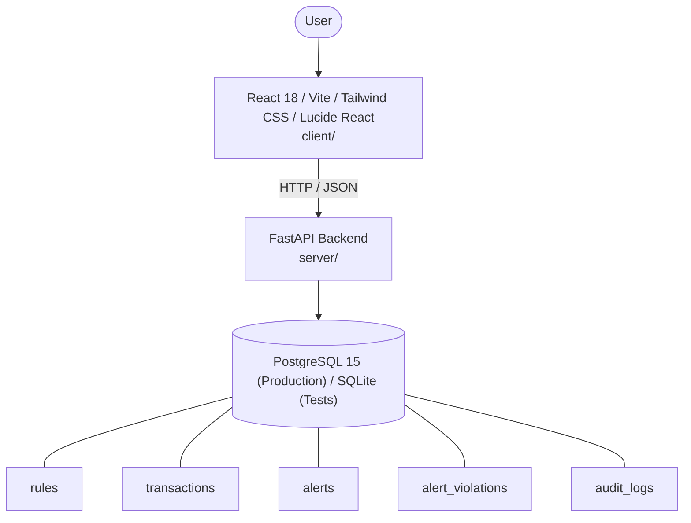

# Architecture

_Auto-generated by the SDLC Assistant from the generated codebase and the approved Feature Spec (latest: SCRUM-384). Regenerated on each push._

## System Diagram

## Tech Stack
- **language**: Python 3.11
- **backend_framework**: FastAPI
- **orm**: SQLAlchemy 2.x
- **database**: PostgreSQL 15 (Production) / SQLite (Tests)
- **frontend**: React 18 / Vite / Tailwind CSS / Lucide React
- **cloud_provider**: Google Cloud Platform (Cloud Run, Cloud SQL)
- **constitution_section_4_followed**: True

## Backend Modules (server/)
- server/__init__.py
- server/config.py
- server/database.py
- server/main.py
- server/models/__init__.py
- server/models/entities.py
- server/routers/__init__.py
- server/routers/alerts.py
- server/routers/audit.py
- server/routers/rules.py
- server/routers/transactions.py
- server/schemas/__init__.py
- server/schemas/alerts.py
- server/schemas/audit.py
- server/schemas/rules.py
- server/schemas/transactions.py
- server/services/__init__.py
- server/services/alerts.py
- server/services/audit.py
- server/services/evaluation.py
- server/services/rules.py
- server/tests/__init__.py
- server/tests/conftest.py
- server/tests/test_alerts.py
- server/tests/test_audit.py
- server/tests/test_rules.py
- server/tests/test_transactions.py

## Frontend Modules (client/)
- client/eslint.config.js
- client/postcss.config.js
- client/src/App.jsx
- client/src/components/AnalyticsDashboard.jsx
- client/src/components/CheckoutPage.jsx
- client/src/components/CurrencySelector.jsx
- client/src/components/Navbar.jsx
- client/src/components/RefundPortal.jsx
- client/src/components/StatusBadge.jsx
- client/src/components/WebhookLogViewer.jsx
- client/src/main.jsx
- client/src/pages/AnalyticsPage.jsx
- client/src/pages/CheckoutPage.jsx
- client/src/pages/RefundPortalPage.jsx
- client/src/services/api.js
- client/src/setup.js
- client/src/tests/AnalyticsDashboard.test.jsx
- client/src/tests/CheckoutPage.test.jsx
- client/src/tests/RefundPortal.test.jsx
- client/tailwind.config.js
- client/vite.config.js

## API Endpoints
- POST /api/v1/transactions/evaluate
- GET /api/v1/transactions
- GET /api/v1/alerts
- GET /api/v1/alerts/{id}
- PATCH /api/v1/alerts/{id}/status
- GET /api/v1/rules
- POST /api/v1/rules
- PUT /api/v1/rules/{id}
- PATCH /api/v1/rules/{id}/toggle

## Data Model
- rules
- transactions
- alerts
- alert_violations
- audit_logs
