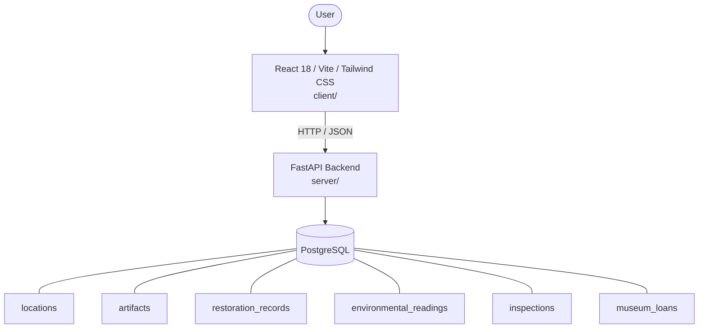

# Architecture

_Auto-generated by the SDLC Assistant from the generated codebase and the approved Feature Spec (latest: SCRUM-379). Regenerated on each push._

## System Diagram

## Tech Stack
- **language**: Python 3.11
- **backend_framework**: FastAPI
- **orm**: SQLAlchemy 2.x
- **database**: PostgreSQL
- **frontend**: React 18 / Vite / Tailwind CSS
- **cloud_provider**: Google Cloud Platform (GCP)
- **constitution_section_4_followed**: True

## Backend Modules (server/)
- server/__init__.py
- server/config.py
- server/database.py
- server/main.py
- server/models.py
- server/routers/__init__.py
- server/routers/artifacts.py
- server/routers/environmental.py
- server/routers/inspections.py
- server/routers/loans.py
- server/routers/locations.py
- server/routers/restorations.py
- server/schemas.py
- server/services/__init__.py
- server/services/artifact_service.py
- server/services/environmental_service.py
- server/services/inspection_service.py
- server/services/loan_service.py
- server/services/restoration_service.py
- server/tests/__init__.py
- server/tests/conftest.py
- server/tests/test_artifacts.py
- server/tests/test_environmental.py
- server/tests/test_inspections.py
- server/tests/test_loans.py
- server/tests/test_locations.py
- server/tests/test_restorations.py

## Frontend Modules (client/)
- client/eslint.config.js
- client/postcss.config.js
- client/src/App.jsx
- client/src/components/AnalyticsDashboard.jsx
- client/src/components/CheckoutPage.jsx
- client/src/components/CurrencySelector.jsx
- client/src/components/Navbar.jsx
- client/src/components/RefundPortal.jsx
- client/src/components/StatusBadge.jsx
- client/src/components/WebhookLogViewer.jsx
- client/src/main.jsx
- client/src/pages/AnalyticsPage.jsx
- client/src/pages/CheckoutPage.jsx
- client/src/pages/RefundPortalPage.jsx
- client/src/services/api.js
- client/src/setup.js
- client/src/tests/AnalyticsDashboard.test.jsx
- client/src/tests/CheckoutPage.test.jsx
- client/src/tests/RefundPortal.test.jsx
- client/tailwind.config.js
- client/vite.config.js

## API Endpoints
- GET /api/v1/artifacts
- POST /api/v1/artifacts
- GET /api/v1/artifacts/{id}
- PUT /api/v1/artifacts/{id}
- DELETE /api/v1/artifacts/{id}
- GET /api/v1/locations
- POST /api/v1/locations
- GET /api/v1/restorations
- POST /api/v1/restorations
- GET /api/v1/environmental-readings
- POST /api/v1/environmental-readings
- GET /api/v1/inspections
- POST /api/v1/inspections
- PUT /api/v1/inspections/{id}/complete
- GET /api/v1/loans
- POST /api/v1/loans
- PUT /api/v1/loans/{id}/status

## Data Model
- locations
- artifacts
- restoration_records
- environmental_readings
- inspections
- museum_loans
