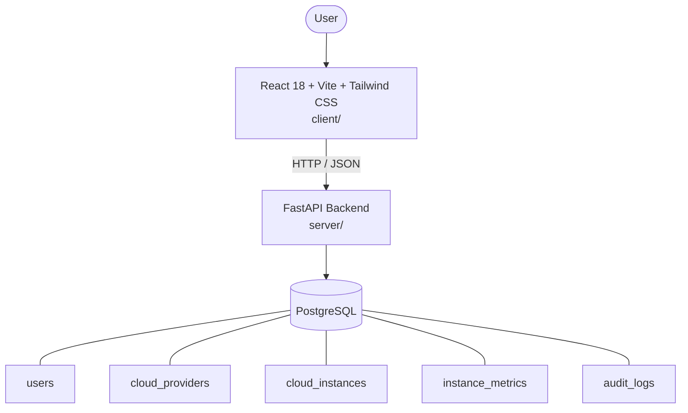

# Architecture

_Auto-generated by the SDLC Assistant from the generated codebase and the approved Feature Spec (latest: SCRUM-350). Regenerated on each push._

## System Diagram

## Tech Stack
- **language**: Python 3.11
- **backend_framework**: FastAPI
- **orm**: SQLAlchemy 2.x
- **database**: PostgreSQL
- **frontend**: React 18 + Vite + Tailwind CSS
- **cloud_provider**: Google Cloud Platform (GCP)
- **constitution_section_4_followed**: True

## Backend Modules (server/)
- server/__init__.py
- server/config.py
- server/database.py
- server/main.py
- server/models.py
- server/routers/__init__.py
- server/routers/audit.py
- server/routers/auth.py
- server/routers/instances.py
- server/routers/metrics.py
- server/routers/providers.py
- server/schemas.py
- server/security.py
- server/services/__init__.py
- server/services/cloud_adapter.py
- server/services/encryption.py
- server/tests/__init__.py
- server/tests/conftest.py
- server/tests/test_audit.py
- server/tests/test_auth.py
- server/tests/test_instances.py
- server/tests/test_metrics.py
- server/tests/test_providers.py

## Frontend Modules (client/)
- client/eslint.config.js
- client/postcss.config.js
- client/src/App.jsx
- client/src/components/AnalyticsDashboard.jsx
- client/src/components/CheckoutPage.jsx
- client/src/components/CurrencySelector.jsx
- client/src/components/Navbar.jsx
- client/src/components/RefundPortal.jsx
- client/src/components/StatusBadge.jsx
- client/src/components/WebhookLogViewer.jsx
- client/src/main.jsx
- client/src/pages/AnalyticsPage.jsx
- client/src/pages/CheckoutPage.jsx
- client/src/pages/RefundPortalPage.jsx
- client/src/services/api.js
- client/src/setup.js
- client/src/tests/AnalyticsDashboard.test.jsx
- client/src/tests/CheckoutPage.test.jsx
- client/src/tests/RefundPortal.test.jsx
- client/tailwind.config.js
- client/vite.config.js

## API Endpoints
- POST /api/v1/auth/login
- GET /api/v1/auth/me
- GET /api/v1/providers
- POST /api/v1/providers
- GET /api/v1/instances
- GET /api/v1/instances/{instance_id}
- POST /api/v1/instances
- POST /api/v1/instances/{instance_id}/action
- GET /api/v1/instances/{instance_id}/metrics
- GET /api/v1/audit-logs

## Data Model
- users
- cloud_providers
- cloud_instances
- instance_metrics
- audit_logs
