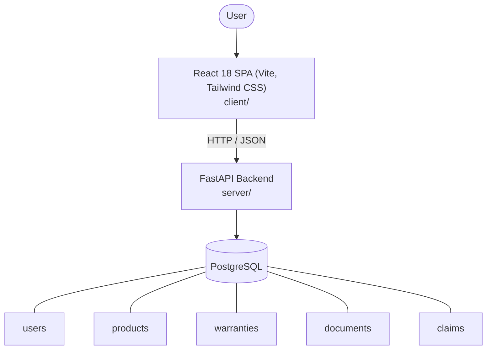

# Architecture

_Auto-generated by the SDLC Assistant from the generated codebase and the approved Feature Spec (latest: SCRUM-359). Regenerated on each push._

## System Diagram

## Tech Stack
- **language**: Python 3.11
- **backend_framework**: FastAPI
- **orm**: SQLAlchemy 2.x
- **database**: PostgreSQL
- **frontend**: React 18 SPA (Vite, Tailwind CSS)
- **cloud_provider**: Google Cloud Platform (Cloud Run, Cloud SQL, GCS)
- **constitution_section_4_followed**: True

## Backend Modules (server/)
- server/__init__.py
- server/auth.py
- server/config.py
- server/database.py
- server/main.py
- server/models.py
- server/routers/__init__.py
- server/routers/alerts.py
- server/routers/auth.py
- server/routers/claims.py
- server/routers/documents.py
- server/routers/products.py
- server/routers/warranties.py
- server/schemas.py
- server/services/__init__.py
- server/services/storage.py
- server/services/warranty_service.py
- server/tests/__init__.py
- server/tests/conftest.py
- server/tests/test_api.py

## Frontend Modules (client/)
- client/eslint.config.js
- client/postcss.config.js
- client/src/App.jsx
- client/src/components/AnalyticsDashboard.jsx
- client/src/components/CheckoutPage.jsx
- client/src/components/CurrencySelector.jsx
- client/src/components/Navbar.jsx
- client/src/components/RefundPortal.jsx
- client/src/components/StatusBadge.jsx
- client/src/components/WebhookLogViewer.jsx
- client/src/main.jsx
- client/src/pages/AnalyticsPage.jsx
- client/src/pages/CheckoutPage.jsx
- client/src/pages/RefundPortalPage.jsx
- client/src/services/api.js
- client/src/setup.js
- client/src/tests/AnalyticsDashboard.test.jsx
- client/src/tests/CheckoutPage.test.jsx
- client/src/tests/RefundPortal.test.jsx
- client/tailwind.config.js
- client/vite.config.js

## API Endpoints
- POST /api/v1/auth/register
- POST /api/v1/auth/login
- GET /api/v1/products
- POST /api/v1/products
- GET /api/v1/products/{product_id}
- PUT /api/v1/products/{product_id}
- DELETE /api/v1/products/{product_id}
- GET /api/v1/warranties
- POST /api/v1/warranties
- GET /api/v1/warranties/{warranty_id}
- PUT /api/v1/warranties/{warranty_id}
- POST /api/v1/documents/upload
- GET /api/v1/documents/{document_id}
- DELETE /api/v1/documents/{document_id}
- GET /api/v1/claims
- POST /api/v1/claims
- GET /api/v1/claims/{claim_id}
- PATCH /api/v1/claims/{claim_id}
- GET /api/v1/alerts

## Data Model
- users
- products
- warranties
- documents
- claims
