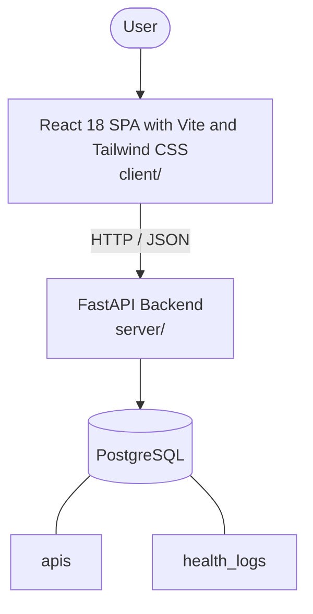

# Architecture

_Auto-generated by the SDLC Assistant from the generated codebase and the approved Feature Spec (latest: SCRUM-334). Regenerated on each push._

## System Diagram

## Tech Stack
- **language**: Python
- **backend_framework**: FastAPI
- **orm**: SQLAlchemy
- **database**: PostgreSQL
- **frontend**: React 18 SPA with Vite and Tailwind CSS
- **cloud_provider**: GCP (Cloud Run, Cloud SQL)
- **constitution_section_4_followed**: True

## Backend Modules (server/)
- server/__init__.py
- server/config.py
- server/database.py
- server/main.py
- server/models/__init__.py
- server/models/api_model.py
- server/models/health_log_model.py
- server/routers/__init__.py
- server/routers/api_router.py
- server/routers/health_log_router.py
- server/routers/metrics_router.py
- server/routers/system_router.py
- server/schemas/__init__.py
- server/schemas/api_schema.py
- server/schemas/health_log_schema.py
- server/schemas/metrics_schema.py
- server/services/__init__.py
- server/services/api_service.py
- server/services/health_poller.py
- server/services/metrics_service.py
- server/services/retention_worker.py
- server/tests/__init__.py
- server/tests/conftest.py
- server/tests/test_apis.py
- server/tests/test_health_logs.py
- server/tests/test_metrics.py
- server/tests/test_poller.py

## Frontend Modules (client/)
- (no client/ files found yet)

## API Endpoints
- GET /api/v1/apis
- POST /api/v1/apis
- GET /api/v1/apis/{id}
- PUT /api/v1/apis/{id}
- DELETE /api/v1/apis/{id}
- POST /api/v1/apis/{id}/check
- GET /api/v1/apis/{id}/logs
- GET /api/v1/apis/{id}/metrics
- GET /api/v1/failures
- GET /api/v1/health

## Data Model
- apis
- health_logs
