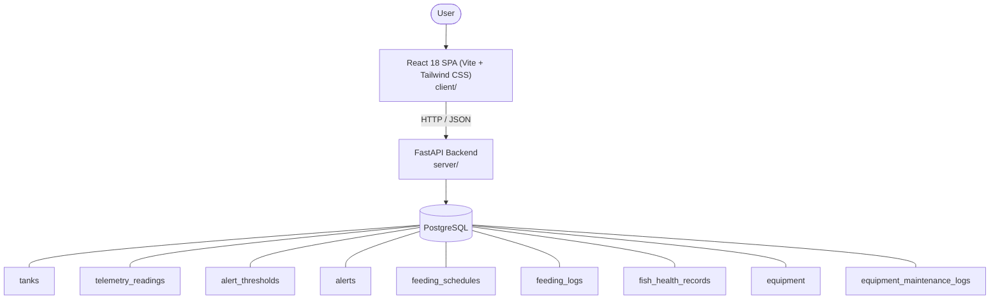

# Architecture

_Auto-generated by the SDLC Assistant from the generated codebase and the approved Feature Spec (latest: SCRUM-388). Regenerated on each push._

## System Diagram

## Tech Stack
- **language**: Python 3.11
- **backend_framework**: FastAPI
- **orm**: SQLAlchemy 2.x
- **database**: PostgreSQL
- **frontend**: React 18 SPA (Vite + Tailwind CSS)
- **cloud_provider**: Google Cloud Platform (Cloud Run, Cloud SQL)
- **constitution_section_4_followed**: True

## Backend Modules (server/)
- server/__init__.py
- server/alert_engine.py
- server/database.py
- server/main.py
- server/models.py
- server/routers/__init__.py
- server/routers/alerts.py
- server/routers/equipment.py
- server/routers/feeding.py
- server/routers/health.py
- server/routers/tanks.py
- server/routers/telemetry.py
- server/schemas.py
- server/tests/__init__.py
- server/tests/conftest.py
- server/tests/test_alerts.py
- server/tests/test_equipment.py
- server/tests/test_feeding.py
- server/tests/test_health.py
- server/tests/test_tanks.py
- server/tests/test_telemetry.py

## Frontend Modules (client/)
- client/eslint.config.js
- client/postcss.config.js
- client/src/App.jsx
- client/src/components/AnalyticsDashboard.jsx
- client/src/components/CheckoutPage.jsx
- client/src/components/CurrencySelector.jsx
- client/src/components/Navbar.jsx
- client/src/components/RefundPortal.jsx
- client/src/components/StatusBadge.jsx
- client/src/components/WebhookLogViewer.jsx
- client/src/main.jsx
- client/src/pages/AnalyticsPage.jsx
- client/src/pages/CheckoutPage.jsx
- client/src/pages/RefundPortalPage.jsx
- client/src/services/api.js
- client/src/setup.js
- client/src/tests/AnalyticsDashboard.test.jsx
- client/src/tests/CheckoutPage.test.jsx
- client/src/tests/RefundPortal.test.jsx
- client/tailwind.config.js
- client/vite.config.js

## API Endpoints
- GET /api/v1/tanks
- POST /api/v1/tanks
- POST /api/v1/telemetry
- GET /api/v1/telemetry
- GET /api/v1/telemetry/latest
- GET /api/v1/thresholds
- POST /api/v1/thresholds
- GET /api/v1/alerts
- PATCH /api/v1/alerts/{id}/status
- GET /api/v1/feeding/schedules
- POST /api/v1/feeding/schedules
- GET /api/v1/feeding/logs
- POST /api/v1/feeding/logs
- GET /api/v1/health-records
- POST /api/v1/health-records
- GET /api/v1/equipment
- POST /api/v1/equipment
- POST /api/v1/equipment/{id}/maintenance-logs

## Data Model
- tanks
- telemetry_readings
- alert_thresholds
- alerts
- feeding_schedules
- feeding_logs
- fish_health_records
- equipment
- equipment_maintenance_logs
