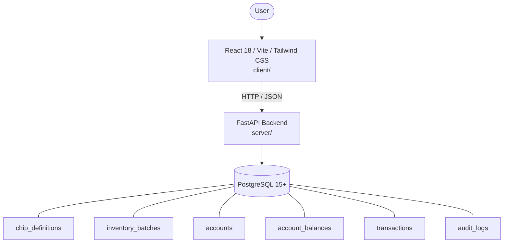

# Architecture

_Auto-generated by the SDLC Assistant from the generated codebase and the approved Feature Spec (latest: SCRUM-309). Regenerated on each push._

## System Diagram

## Tech Stack
- **language**: Python 3.11
- **backend_framework**: FastAPI
- **orm**: SQLAlchemy 2.x
- **database**: PostgreSQL 15+
- **frontend**: React 18 / Vite / Tailwind CSS
- **cloud_provider**: GCP (Cloud Run / Cloud SQL)
- **constitution_section_4_followed**: True

## Backend Modules (server/)
- server/__init__.py
- server/config.py
- server/database.py
- server/main.py
- server/models.py
- server/routers/__init__.py
- server/routers/accounts.py
- server/routers/analytics.py
- server/routers/audit.py
- server/routers/chips.py
- server/routers/transfers.py
- server/schemas.py
- server/services/__init__.py
- server/services/audit_service.py
- server/services/inventory_service.py
- server/services/transfer_service.py
- server/tests/__init__.py
- server/tests/conftest.py
- server/tests/test_accounts.py
- server/tests/test_audit.py
- server/tests/test_chips.py
- server/tests/test_transfers.py

## Frontend Modules (client/)
- (no client/ files found yet)

## API Endpoints
- POST /api/v1/chips
- GET /api/v1/chips
- GET /api/v1/chips/{chip_id}
- POST /api/v1/chips/{chip_id}/batches
- PATCH /api/v1/chips/{chip_id}/status
- POST /api/v1/transfers/allocate
- POST /api/v1/transfers/transfer
- POST /api/v1/transfers/redeem
- GET /api/v1/accounts/{account_id}/balance
- GET /api/v1/accounts
- GET /api/v1/audit/logs
- GET /api/v1/analytics/dashboard

## Data Model
- chip_definitions
- inventory_batches
- accounts
- account_balances
- transactions
- audit_logs
