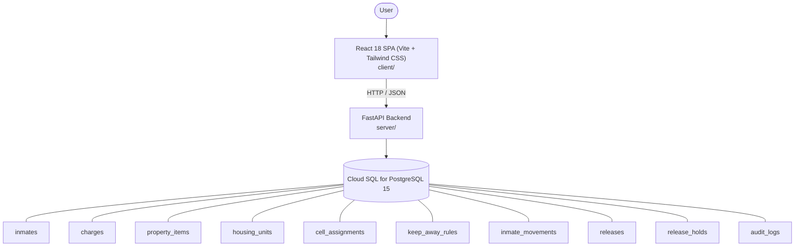

# Architecture

_Auto-generated by the SDLC Assistant from the generated codebase and the approved Feature Spec (latest: SCRUM-328). Regenerated on each push._

## System Diagram

## Tech Stack
- **language**: Python 3.11
- **backend_framework**: FastAPI
- **orm**: SQLAlchemy 2.0
- **database**: Cloud SQL for PostgreSQL 15
- **frontend**: React 18 SPA (Vite + Tailwind CSS)
- **cloud_provider**: GCP (Cloud Run + Cloud SQL + GCS)
- **constitution_section_4_followed**: True

## Backend Modules (server/)
- server/__init__.py
- server/api/__init__.py
- server/api/v1/__init__.py
- server/config.py
- server/database.py
- server/main.py
- server/middleware/__init__.py
- server/middleware/audit.py
- server/middleware/auth.py
- server/models.py
- server/models/__init__.py
- server/models/audit.py
- server/models/housing.py
- server/models/inmate.py
- server/models/movement.py
- server/models/release.py
- server/routes/__init__.py
- server/routes/audit.py
- server/routes/auth.py
- server/routes/housing.py
- server/routes/inmates.py
- server/routes/movements.py
- server/routes/releases.py
- server/schemas.py
- server/schemas/__init__.py
- server/schemas/audit.py
- server/schemas/auth.py
- server/schemas/housing.py
- server/schemas/inmate.py
- server/schemas/movement.py
- server/schemas/release.py
- server/services/__init__.py
- server/services/audit_service.py
- server/services/currency_service.py
- server/services/stripe_service.py
- server/services/wallet_service.py
- server/tests/conftest.py
- server/tests/test_audit.py
- server/tests/test_auth.py
- server/tests/test_housing.py

## Frontend Modules (client/)
- client/eslint.config.js
- client/postcss.config.js
- client/src/App.jsx
- client/src/components/AnalyticsDashboard.jsx
- client/src/components/CheckoutPage.jsx
- client/src/components/CurrencySelector.jsx
- client/src/components/Navbar.jsx
- client/src/components/RefundPortal.jsx
- client/src/components/StatusBadge.jsx
- client/src/components/WebhookLogViewer.jsx
- client/src/main.jsx
- client/src/pages/AnalyticsPage.jsx
- client/src/pages/CheckoutPage.jsx
- client/src/pages/RefundPortalPage.jsx
- client/src/services/api.js
- client/src/setup.js
- client/src/tests/AnalyticsDashboard.test.jsx
- client/src/tests/CheckoutPage.test.jsx
- client/src/tests/RefundPortal.test.jsx
- client/tailwind.config.js
- client/vite.config.js

## API Endpoints
- POST /api/v1/inmates
- GET /api/v1/inmates
- GET /api/v1/inmates/{id}
- GET /api/v1/housing/units
- POST /api/v1/housing/assign
- POST /api/v1/housing/keep-away
- POST /api/v1/movements
- PUT /api/v1/movements/{id}/complete
- GET /api/v1/movements/active
- GET /api/v1/movements/headcount
- POST /api/v1/releases/check-eligibility/{inmate_id}
- POST /api/v1/releases/authorize
- POST /api/v1/auth/login
- GET /api/v1/audit/logs

## Data Model
- inmates
- charges
- property_items
- housing_units
- cell_assignments
- keep_away_rules
- inmate_movements
- releases
- release_holds
- audit_logs
