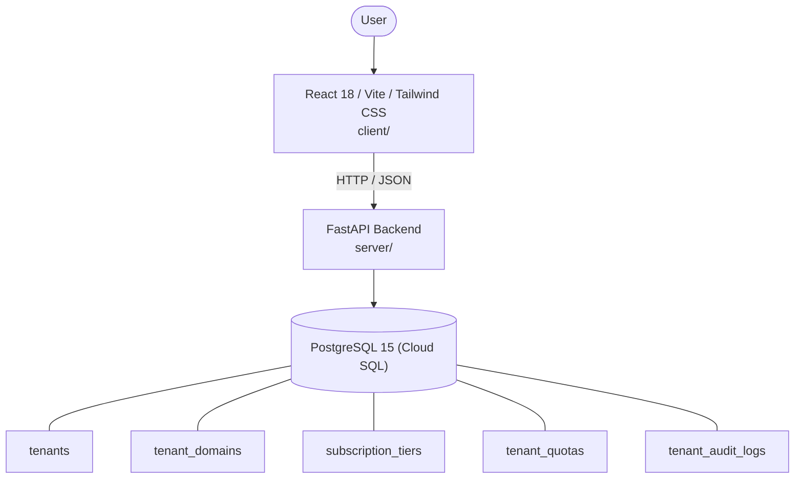

# Architecture

_Auto-generated by the SDLC Assistant from the generated codebase and the approved Feature Spec (latest: SCRUM-293). Regenerated on each push._

## System Diagram

## Tech Stack
- **language**: Python 3.11
- **backend_framework**: FastAPI
- **orm**: SQLAlchemy 2.0 (asyncpg)
- **database**: PostgreSQL 15 (Cloud SQL)
- **frontend**: React 18 / Vite / Tailwind CSS
- **cloud_provider**: Google Cloud Platform (Cloud Run, Cloud SQL, Cloud Memorystore)
- **constitution_section_4_followed**: True

## Backend Modules (server/)
- server/__init__.py
- server/api/__init__.py
- server/api/subscriptions.py
- server/api/tenants.py
- server/database.py
- server/main.py
- server/middleware/__init__.py
- server/middleware/tenant.py
- server/models.py
- server/schemas.py
- server/services/__init__.py
- server/services/audit_service.py
- server/services/tenant_service.py
- server/services/tier_service.py
- server/tests/__init__.py
- server/tests/conftest.py
- server/tests/test_qa_simulation.py
- server/tests/test_tenants.py

## Frontend Modules (client/)
- client/eslint.config.js
- client/postcss.config.js
- client/src/App.jsx
- client/src/App.test.jsx
- client/src/components/layout/Navbar.jsx
- client/src/components/tenants/AuditLogTimeline.jsx
- client/src/components/tenants/CustomDomainsList.jsx
- client/src/components/tenants/QuotaEditor.jsx
- client/src/components/tenants/TenantOnboardingWizard.jsx
- client/src/components/tenants/TenantTable.jsx
- client/src/main.jsx
- client/src/pages/TenantDetailPage.jsx
- client/src/pages/TenantDirectoryPage.jsx
- client/src/pages/TenantOnboardingPage.jsx
- client/src/services/api.js
- client/src/setup.js
- client/tailwind.config.js
- client/vite.config.js

## API Endpoints
- POST /api/v1/tenants
- GET /api/v1/tenants
- GET /api/v1/tenants/{id}
- PUT /api/v1/tenants/{id}
- PATCH /api/v1/tenants/{id}/status
- DELETE /api/v1/tenants/{id}
- POST /api/v1/tenants/{id}/domains
- GET /api/v1/tenants/{id}/domains
- DELETE /api/v1/tenants/{id}/domains/{domain_id}
- GET /api/v1/subscription-tiers
- PUT /api/v1/tenants/{id}/subscription
- GET /api/v1/tenants/{id}/usage
- GET /api/v1/tenants/{id}/audit-logs

## Data Model
- tenants
- tenant_domains
- subscription_tiers
- tenant_quotas
- tenant_audit_logs
