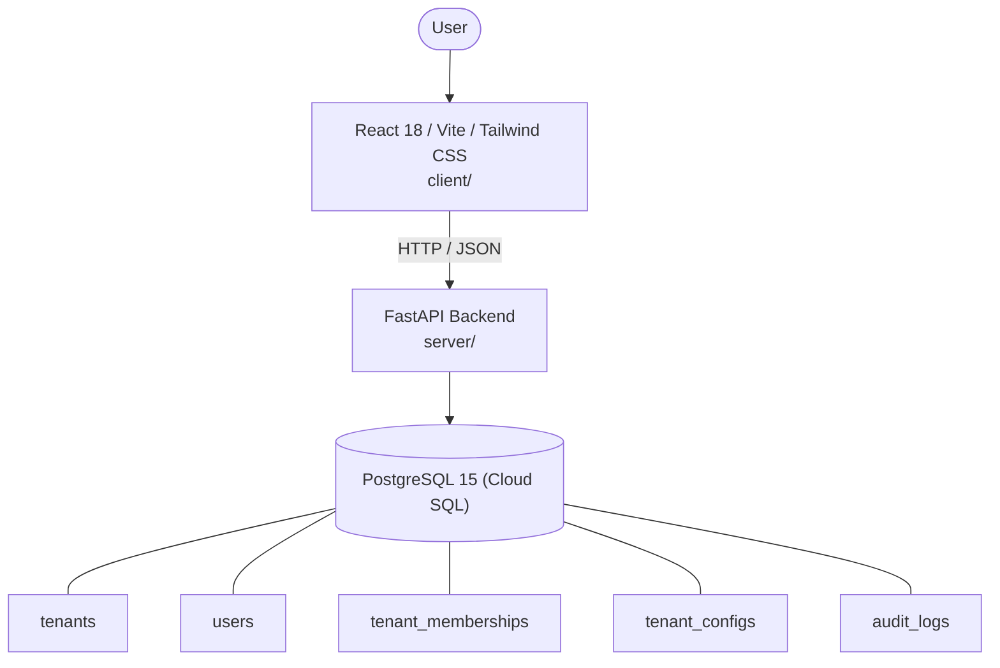

# Architecture

_Auto-generated by the SDLC Assistant from the generated codebase and the approved Feature Spec (latest: SCRUM-285). Regenerated on each push._

## System Diagram

## Tech Stack
- **language**: Python 3.11
- **backend_framework**: FastAPI
- **orm**: SQLAlchemy 2.x (Async)
- **database**: PostgreSQL 15 (Cloud SQL)
- **frontend**: React 18 / Vite / Tailwind CSS
- **cloud_provider**: Google Cloud Platform (GCP Cloud Run)
- **constitution_section_4_followed**: True

## Backend Modules (server/)
- server/__init__.py
- server/database.py
- server/main.py
- server/middleware/__init__.py
- server/middleware/rate_limiter.py
- server/middleware/tenant_context.py
- server/models.py
- server/routers/__init__.py
- server/routers/audit.py
- server/routers/configs.py
- server/routers/tenants.py
- server/routers/users.py
- server/schemas.py
- server/services/__init__.py
- server/services/audit_service.py
- server/services/config_service.py
- server/services/rbac_service.py
- server/services/tenant_service.py
- server/tests/__init__.py
- server/tests/conftest.py
- server/tests/test_audit.py
- server/tests/test_configs.py
- server/tests/test_tenants.py
- server/tests/test_users.py

## Frontend Modules (client/)
- (no client/ files found yet)

## API Endpoints
- POST /api/v1/tenants
- GET /api/v1/tenants
- GET /api/v1/tenants/{tenant_id}
- PATCH /api/v1/tenants/{tenant_id}/status
- GET /api/v1/tenants/{tenant_id}/users
- POST /api/v1/tenants/{tenant_id}/users
- DELETE /api/v1/tenants/{tenant_id}/users/{user_id}
- GET /api/v1/tenants/{tenant_id}/config
- PUT /api/v1/tenants/{tenant_id}/config
- GET /api/v1/tenants/{tenant_id}/audit-logs

## Data Model
- tenants
- users
- tenant_memberships
- tenant_configs
- audit_logs
