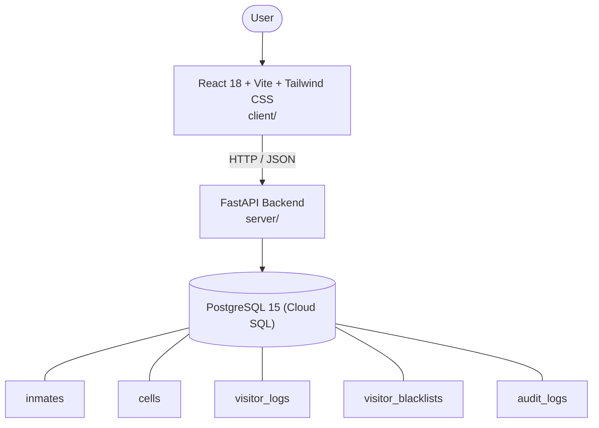

# Architecture

_Auto-generated by the SDLC Assistant from the generated codebase and the approved Feature Spec (latest: SCRUM-331). Regenerated on each push._

## System Diagram

## Tech Stack
- **language**: Python 3.11
- **backend_framework**: FastAPI 0.110+
- **orm**: SQLAlchemy 2.x
- **database**: PostgreSQL 15 (Cloud SQL)
- **frontend**: React 18 + Vite + Tailwind CSS
- **cloud_provider**: GCP (Cloud Run)
- **constitution_section_4_followed**: True

## Backend Modules (server/)
- server/__init__.py
- server/api/__init__.py
- server/api/v1/__init__.py
- server/config.py
- server/database.py
- server/main.py
- server/models.py
- server/routers/__init__.py
- server/routers/audit.py
- server/routers/auth.py
- server/routers/cells.py
- server/routers/inmates.py
- server/routers/visitors.py
- server/schemas.py
- server/services/__init__.py
- server/services/audit_service.py
- server/services/currency_service.py
- server/services/stripe_service.py
- server/services/wallet_service.py
- server/tests/__init__.py
- server/tests/conftest.py
- server/tests/test_audit.py
- server/tests/test_cells.py
- server/tests/test_inmates.py
- server/tests/test_visitors.py

## Frontend Modules (client/)
- client/eslint.config.js
- client/postcss.config.js
- client/src/App.jsx
- client/src/components/AnalyticsDashboard.jsx
- client/src/components/CheckoutPage.jsx
- client/src/components/CurrencySelector.jsx
- client/src/components/Navbar.jsx
- client/src/components/RefundPortal.jsx
- client/src/components/StatusBadge.jsx
- client/src/components/WebhookLogViewer.jsx
- client/src/main.jsx
- client/src/pages/AnalyticsPage.jsx
- client/src/pages/CheckoutPage.jsx
- client/src/pages/RefundPortalPage.jsx
- client/src/services/api.js
- client/src/setup.js
- client/src/tests/AnalyticsDashboard.test.jsx
- client/src/tests/CheckoutPage.test.jsx
- client/src/tests/RefundPortal.test.jsx
- client/tailwind.config.js
- client/vite.config.js

## API Endpoints
- POST /api/v1/inmates
- GET /api/v1/inmates
- POST /api/v1/cells/assign
- POST /api/v1/visitors/check-in

## Data Model
- inmates
- cells
- visitor_logs
- visitor_blacklists
- audit_logs
