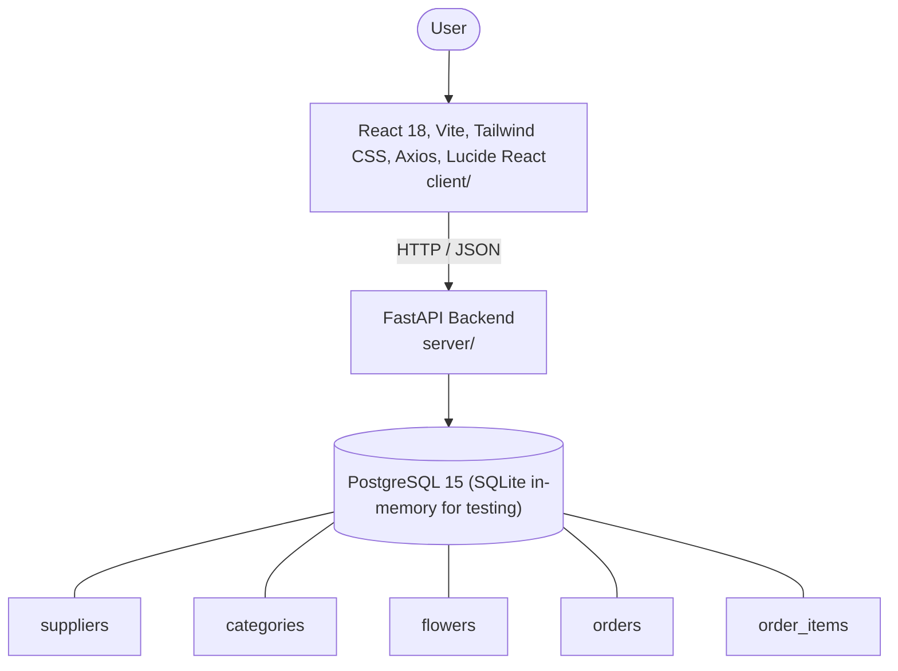

# Architecture

_Auto-generated by the SDLC Assistant from the generated codebase and the approved Feature Spec (latest: SCRUM-324). Regenerated on each push._

## System Diagram

## Tech Stack
- **language**: Python 3.11
- **backend_framework**: FastAPI
- **orm**: SQLAlchemy 2.x
- **database**: PostgreSQL 15 (SQLite in-memory for testing)
- **frontend**: React 18, Vite, Tailwind CSS, Axios, Lucide React
- **cloud_provider**: Google Cloud Platform (GCP Cloud Run)
- **constitution_section_4_followed**: True

## Backend Modules (server/)
- server/__init__.py
- server/crud.py
- server/database.py
- server/main.py
- server/models.py
- server/routers/__init__.py
- server/routers/analytics.py
- server/routers/categories.py
- server/routers/flowers.py
- server/routers/orders.py
- server/routers/suppliers.py
- server/schemas.py
- server/tests/__init__.py
- server/tests/conftest.py
- server/tests/test_analytics.py
- server/tests/test_flowers.py
- server/tests/test_orders.py
- server/tests/test_suppliers.py

## Frontend Modules (client/)
- (no client/ files found yet)

## API Endpoints
- GET /api/v1/flowers
- POST /api/v1/flowers
- GET /api/v1/flowers/{id}
- PUT /api/v1/flowers/{id}
- DELETE /api/v1/flowers/{id}
- GET /api/v1/orders
- POST /api/v1/orders
- GET /api/v1/orders/{id}
- PATCH /api/v1/orders/{id}/status
- GET /api/v1/suppliers
- POST /api/v1/suppliers
- GET /api/v1/suppliers/{id}
- PUT /api/v1/suppliers/{id}
- DELETE /api/v1/suppliers/{id}
- GET /api/v1/analytics/dashboard

## Data Model
- suppliers
- categories
- flowers
- orders
- order_items
