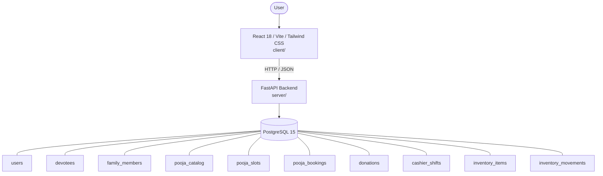

# Architecture

_Auto-generated by the SDLC Assistant from the generated codebase and the approved Feature Spec (latest: SCRUM-320). Regenerated on each push._

## System Diagram

## Tech Stack
- **language**: Python 3.11
- **backend_framework**: FastAPI
- **orm**: SQLAlchemy 2.x
- **database**: PostgreSQL 15
- **frontend**: React 18 / Vite / Tailwind CSS
- **cloud_provider**: Google Cloud Platform (GCP)
- **constitution_section_4_followed**: True

## Backend Modules (server/)
- server/__init__.py
- server/database.py
- server/main.py
- server/models.py
- server/schemas.py
- server/services/__init__.py
- server/services/auth_service.py
- server/services/devotee_service.py
- server/services/donation_service.py
- server/services/finance_service.py
- server/services/inventory_service.py
- server/services/payment_service.py
- server/services/pooja_service.py
- server/tests/__init__.py
- server/tests/conftest.py
- server/tests/test_auth.py
- server/tests/test_devotees.py
- server/tests/test_donations.py
- server/tests/test_finance.py
- server/tests/test_inventory.py
- server/tests/test_poojas.py

## Frontend Modules (client/)
- client/src/App.jsx
- client/src/components/Navbar.jsx
- client/src/components/devotee/DevoteeForm.jsx
- client/src/components/devotee/DevoteeTable.jsx
- client/src/components/donation/DonationForm.jsx
- client/src/components/donation/Receipt80G.jsx
- client/src/components/finance/AuditLedger.jsx
- client/src/components/finance/ShiftReconcile.jsx
- client/src/components/inventory/InventoryTable.jsx
- client/src/components/inventory/VaultCard.jsx
- client/src/components/pooja/PoojaCatalog.jsx
- client/src/components/pooja/QRPassCard.jsx
- client/src/components/pooja/SlotMatrix.jsx
- client/src/main.jsx
- client/src/pages/DevoteesPage.jsx
- client/src/pages/DonationsPage.jsx
- client/src/pages/FinancePage.jsx
- client/src/pages/InventoryPage.jsx
- client/src/pages/PoojaBookingPage.jsx
- client/src/services/api.js
- client/src/tests/DevoteesPage.test.jsx
- client/src/tests/DonationsPage.test.jsx
- client/src/tests/FinancePage.test.jsx
- client/src/tests/InventoryPage.test.jsx
- client/src/tests/PoojaBookingPage.test.jsx

## API Endpoints
- POST /api/v1/devotees
- GET /api/v1/devotees
- GET /api/v1/devotees/{id}
- POST /api/v1/devotees/{id}/family
- GET /api/v1/poojas
- GET /api/v1/poojas/{pooja_id}/slots
- POST /api/v1/bookings
- GET /api/v1/bookings/{id}
- POST /api/v1/bookings/{id}/verify-qr
- POST /api/v1/donations
- GET /api/v1/donations/{id}
- GET /api/v1/donations
- GET /api/v1/inventory/items
- POST /api/v1/inventory/movements
- GET /api/v1/inventory/alerts
- POST /api/v1/finance/shifts/open
- POST /api/v1/finance/shifts/{id}/close
- GET /api/v1/finance/reports/daily
- GET /api/v1/finance/audit-logs

## Data Model
- users
- devotees
- family_members
- pooja_catalog
- pooja_slots
- pooja_bookings
- donations
- cashier_shifts
- inventory_items
- inventory_movements
