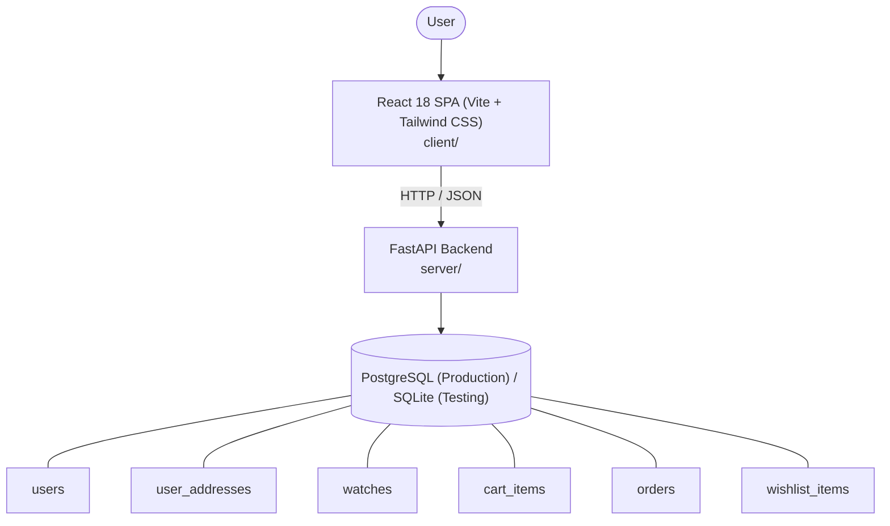

# Architecture

_Auto-generated by the SDLC Assistant from the generated codebase and the approved Feature Spec (latest: SCRUM-341). Regenerated on each push._

## System Diagram

## Tech Stack
- **language**: Python 3.11
- **backend_framework**: FastAPI
- **orm**: SQLAlchemy 2.x
- **database**: PostgreSQL (Production) / SQLite (Testing)
- **frontend**: React 18 SPA (Vite + Tailwind CSS)
- **cloud_provider**: Google Cloud Platform (GCP) - Cloud Run & Cloud SQL
- **constitution_section_4_followed**: True

## Backend Modules (server/)
- server/__init__.py
- server/auth.py
- server/config.py
- server/database.py
- server/main.py
- server/models.py
- server/routers/__init__.py
- server/routers/auth.py
- server/routers/cart.py
- server/routers/orders.py
- server/routers/watches.py
- server/routers/wishlist.py
- server/schemas.py
- server/seed_data.py
- server/tests/__init__.py
- server/tests/conftest.py
- server/tests/test_auth.py
- server/tests/test_cart.py
- server/tests/test_orders.py
- server/tests/test_watches.py
- server/tests/test_wishlist.py

## Frontend Modules (client/)
- client/eslint.config.js
- client/postcss.config.js
- client/src/App.jsx
- client/src/components/AnalyticsDashboard.jsx
- client/src/components/CheckoutPage.jsx
- client/src/components/CurrencySelector.jsx
- client/src/components/Navbar.jsx
- client/src/components/RefundPortal.jsx
- client/src/components/StatusBadge.jsx
- client/src/components/WebhookLogViewer.jsx
- client/src/main.jsx
- client/src/pages/AnalyticsPage.jsx
- client/src/pages/CheckoutPage.jsx
- client/src/pages/RefundPortalPage.jsx
- client/src/services/api.js
- client/src/setup.js
- client/src/tests/AnalyticsDashboard.test.jsx
- client/src/tests/CheckoutPage.test.jsx
- client/src/tests/RefundPortal.test.jsx
- client/tailwind.config.js
- client/vite.config.js

## API Endpoints
- POST /api/v1/auth/register
- POST /api/v1/auth/login
- GET /api/v1/auth/me
- GET /api/v1/watches
- GET /api/v1/watches/{id}
- POST /api/v1/watches
- POST /api/v1/cart/reserve
- DELETE /api/v1/cart/reserve/{watch_id}
- POST /api/v1/orders/checkout
- GET /api/v1/orders
- GET /api/v1/orders/{id}
- PATCH /api/v1/orders/{id}/status
- GET /api/v1/wishlist
- POST /api/v1/wishlist/{watch_id}

## Data Model
- users
- user_addresses
- watches
- cart_items
- orders
- wishlist_items
