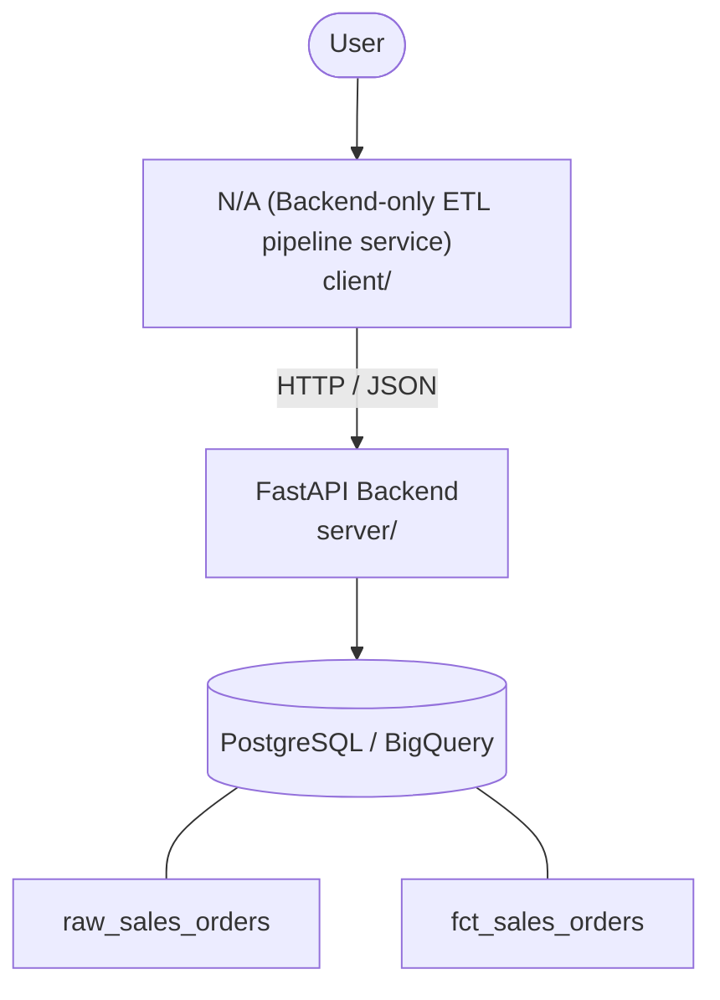

# Architecture

_Auto-generated by the SDLC Assistant from the generated codebase and the approved Feature Spec (latest: SCRUM-289). Regenerated on each push._

## System Diagram

## Tech Stack
- **language**: Python 3.11
- **backend_framework**: FastAPI
- **orm**: SQLAlchemy 2.x
- **database**: PostgreSQL / BigQuery
- **frontend**: N/A (Backend-only ETL pipeline service)
- **cloud_provider**: Google Cloud Platform (GCP)
- **constitution_section_4_followed**: True

## Backend Modules (server/)
- server/__init__.py
- server/api/__init__.py
- server/api/v1/__init__.py
- server/api/v1/etl.py
- server/config.py
- server/database.py
- server/main.py
- server/models.py
- server/schemas.py
- server/services/__init__.py
- server/services/audit.py
- server/services/extractor.py
- server/services/loader.py
- server/services/validator.py
- server/tests/__init__.py
- server/tests/conftest.py
- server/tests/test_etl.py
- server/tests/test_validator.py

## Frontend Modules (client/)
- (no client/ files found yet)

## API Endpoints
- POST /api/v1/etl/sales-orders/run
- GET /api/v1/etl/sales-orders/status/{job_id}

## Data Model
- raw_sales_orders
- fct_sales_orders
