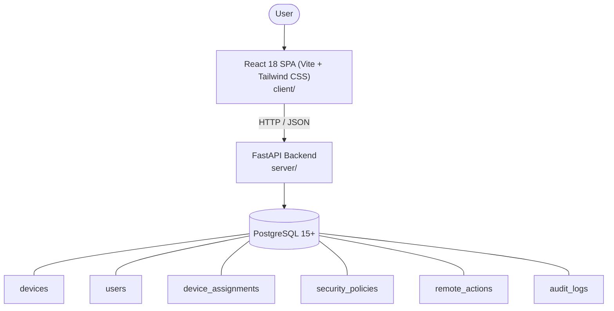

# Architecture

_Auto-generated by the SDLC Assistant from the generated codebase and the approved Feature Spec (latest: SCRUM-326). Regenerated on each push._

## System Diagram

## Tech Stack
- **language**: Python 3.11
- **backend_framework**: FastAPI
- **orm**: SQLAlchemy 2.x
- **database**: PostgreSQL 15+
- **frontend**: React 18 SPA (Vite + Tailwind CSS)
- **cloud_provider**: GCP (Cloud Run, Cloud SQL, Cloud Storage)
- **constitution_section_4_followed**: True

## Backend Modules (server/)
- server/__init__.py
- server/auth.py
- server/database.py
- server/main.py
- server/models.py
- server/routers/__init__.py
- server/routers/analytics.py
- server/routers/audit.py
- server/routers/auth.py
- server/routers/devices.py
- server/routers/policies.py
- server/routers/users.py
- server/schemas.py
- server/services/__init__.py
- server/services/analytics_service.py
- server/services/assignment_service.py
- server/services/audit_service.py
- server/services/command_service.py
- server/services/device_service.py
- server/tests/__init__.py
- server/tests/conftest.py
- server/tests/test_analytics_audit.py
- server/tests/test_assignments.py
- server/tests/test_auth.py
- server/tests/test_devices.py
- server/tests/test_policies_actions.py

## Frontend Modules (client/)
- (no client/ files found yet)

## API Endpoints
- POST /api/v1/auth/login
- GET /api/v1/auth/me
- GET /api/v1/devices
- POST /api/v1/devices
- GET /api/v1/devices/{id}
- PUT /api/v1/devices/{id}
- DELETE /api/v1/devices/{id}
- POST /api/v1/devices/{id}/assign
- POST /api/v1/devices/{id}/unassign
- GET /api/v1/devices/{id}/assignments
- POST /api/v1/devices/{id}/actions
- GET /api/v1/users
- GET /api/v1/policies
- PUT /api/v1/policies/{id}
- GET /api/v1/analytics/dashboard
- GET /api/v1/audit-logs

## Data Model
- devices
- users
- device_assignments
- security_policies
- remote_actions
- audit_logs
