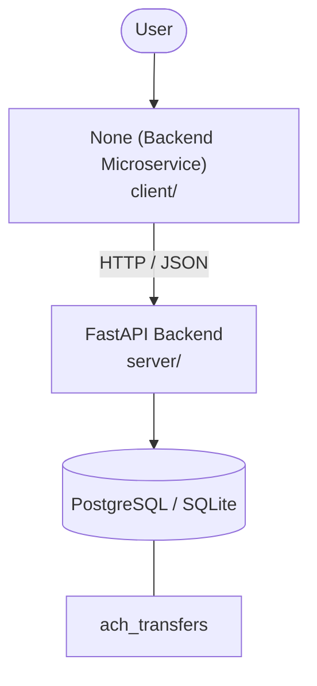

# Architecture

_Auto-generated by the SDLC Assistant from the generated codebase and the approved Feature Spec (latest: SCRUM-286). Regenerated on each push._

## System Diagram

## Tech Stack
- **language**: Python
- **backend_framework**: FastAPI
- **orm**: SQLAlchemy
- **database**: PostgreSQL / SQLite
- **frontend**: None (Backend Microservice)
- **cloud_provider**: GCP
- **constitution_section_4_followed**: True

## Backend Modules (server/)
- server/__init__.py
- server/app/__init__.py
- server/app/api/__init__.py
- server/app/api/v1/__init__.py
- server/app/api/v1/endpoints/__init__.py
- server/app/api/v1/endpoints/ach_transfers.py
- server/app/core/__init__.py
- server/app/core/config.py
- server/app/core/middleware.py
- server/app/db/__init__.py
- server/app/db/base.py
- server/app/db/session.py
- server/app/main.py
- server/app/models/__init__.py
- server/app/models/ach_transfer.py
- server/app/schemas/__init__.py
- server/app/schemas/ach_transfer.py
- server/app/services/__init__.py
- server/app/services/velocity_service.py
- server/tests/__init__.py
- server/tests/conftest.py
- server/tests/test_velocity_api.py

## Frontend Modules (client/)
- (no client/ files found yet)

## API Endpoints
- POST /api/v1/ach/transfers/evaluate

## Data Model
- ach_transfers
