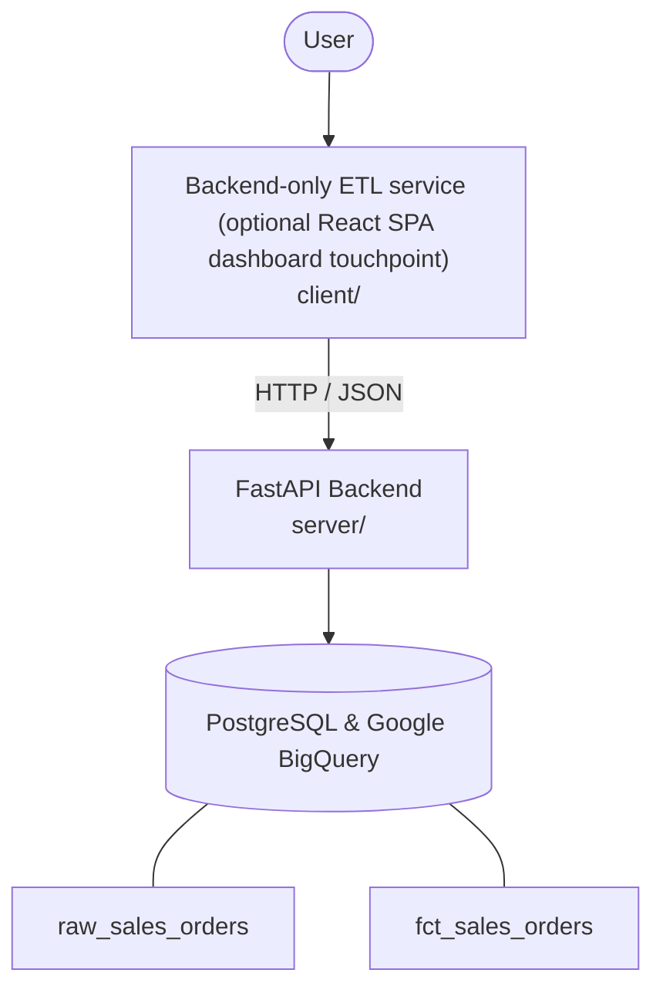

# Architecture

_Auto-generated by the SDLC Assistant from the generated codebase and the approved Feature Spec (latest: SCRUM-290). Regenerated on each push._

## System Diagram

## Tech Stack
- **language**: Python 3.11
- **backend_framework**: FastAPI
- **orm**: SQLAlchemy 2.x
- **database**: PostgreSQL & Google BigQuery
- **frontend**: Backend-only ETL service (optional React SPA dashboard touchpoint)
- **cloud_provider**: Google Cloud Platform (GCP)
- **constitution_section_4_followed**: True

## Backend Modules (server/)
- server/__init__.py
- server/api/__init__.py
- server/api/v1/__init__.py
- server/api/v1/audit.py
- server/api/v1/payments.py
- server/api/v1/refunds.py
- server/api/v1/webhooks.py
- server/config.py
- server/database.py
- server/main.py
- server/models.py
- server/pipeline/__init__.py
- server/pipeline/extractor.py
- server/pipeline/loader.py
- server/pipeline/logger.py
- server/pipeline/transformer.py
- server/pipeline/validator.py
- server/schemas.py
- server/services/__init__.py
- server/services/audit_service.py
- server/services/currency_service.py
- server/services/stripe_service.py
- server/services/wallet_service.py
- server/tests/__init__.py
- server/tests/conftest.py
- server/tests/test_audit.py
- server/tests/test_payments.py
- server/tests/test_refunds.py
- server/tests/test_webhooks.py

## Frontend Modules (client/)
- client/eslint.config.js
- client/postcss.config.js
- client/src/App.jsx
- client/src/components/AnalyticsDashboard.jsx
- client/src/components/CheckoutPage.jsx
- client/src/components/CurrencySelector.jsx
- client/src/components/Navbar.jsx
- client/src/components/RefundPortal.jsx
- client/src/components/StatusBadge.jsx
- client/src/components/WebhookLogViewer.jsx
- client/src/main.jsx
- client/src/pages/AnalyticsPage.jsx
- client/src/pages/CheckoutPage.jsx
- client/src/pages/RefundPortalPage.jsx
- client/src/services/api.js
- client/src/setup.js
- client/src/tests/AnalyticsDashboard.test.jsx
- client/src/tests/CheckoutPage.test.jsx
- client/src/tests/RefundPortal.test.jsx
- client/tailwind.config.js
- client/vite.config.js

## API Endpoints
- POST /api/v1/pipeline/run
- GET /api/v1/health

## Data Model
- raw_sales_orders
- fct_sales_orders
