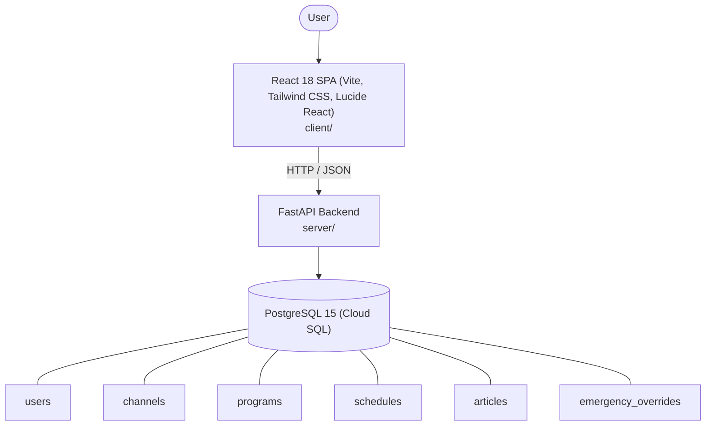

# Architecture

_Auto-generated by the SDLC Assistant from the generated codebase and the approved Feature Spec (latest: SCRUM-327). Regenerated on each push._

## System Diagram

## Tech Stack
- **language**: Python 3.11
- **backend_framework**: FastAPI
- **orm**: SQLAlchemy 2.x
- **database**: PostgreSQL 15 (Cloud SQL)
- **frontend**: React 18 SPA (Vite, Tailwind CSS, Lucide React)
- **cloud_provider**: Google Cloud Platform (GCP)
- **constitution_section_4_followed**: True

## Backend Modules (server/)
- server/__init__.py
- server/api/__init__.py
- server/api/v1/__init__.py
- server/api/v1/articles.py
- server/api/v1/audit.py
- server/api/v1/auth.py
- server/api/v1/channels.py
- server/api/v1/dashboard.py
- server/api/v1/payments.py
- server/api/v1/programs.py
- server/api/v1/refunds.py
- server/api/v1/schedules.py
- server/api/v1/webhooks.py
- server/auth.py
- server/config.py
- server/database.py
- server/main.py
- server/models.py
- server/schemas.py
- server/services/__init__.py
- server/services/audit_service.py
- server/services/currency_service.py
- server/services/stripe_service.py
- server/services/wallet_service.py
- server/tests/__init__.py
- server/tests/conftest.py
- server/tests/test_articles.py
- server/tests/test_audit.py
- server/tests/test_auth.py
- server/tests/test_channels.py
- server/tests/test_dashboard.py
- server/tests/test_payments.py
- server/tests/test_programs.py
- server/tests/test_refunds.py
- server/tests/test_schedules.py
- server/tests/test_webhooks.py

## Frontend Modules (client/)
- client/eslint.config.js
- client/postcss.config.js
- client/src/App.jsx
- client/src/components/AnalyticsDashboard.jsx
- client/src/components/CheckoutPage.jsx
- client/src/components/CurrencySelector.jsx
- client/src/components/Navbar.jsx
- client/src/components/RefundPortal.jsx
- client/src/components/StatusBadge.jsx
- client/src/components/WebhookLogViewer.jsx
- client/src/main.jsx
- client/src/pages/AnalyticsPage.jsx
- client/src/pages/CheckoutPage.jsx
- client/src/pages/RefundPortalPage.jsx
- client/src/services/api.js
- client/src/setup.js
- client/src/tests/AnalyticsDashboard.test.jsx
- client/src/tests/CheckoutPage.test.jsx
- client/src/tests/RefundPortal.test.jsx
- client/tailwind.config.js
- client/vite.config.js

## API Endpoints
- POST /api/v1/auth/login
- GET /api/v1/auth/me
- GET /api/v1/channels
- POST /api/v1/channels
- GET /api/v1/channels/{id}
- PUT /api/v1/channels/{id}
- DELETE /api/v1/channels/{id}
- GET /api/v1/programs
- POST /api/v1/programs
- GET /api/v1/programs/{id}
- PUT /api/v1/programs/{id}
- DELETE /api/v1/programs/{id}
- GET /api/v1/schedules
- POST /api/v1/schedules
- GET /api/v1/schedules/{id}
- PUT /api/v1/schedules/{id}
- DELETE /api/v1/schedules/{id}
- GET /api/v1/schedules/live
- POST /api/v1/schedules/{id}/override
- GET /api/v1/articles
- POST /api/v1/articles
- GET /api/v1/articles/{id}
- PUT /api/v1/articles/{id}
- PATCH /api/v1/articles/{id}/status
- DELETE /api/v1/articles/{id}
- GET /api/v1/dashboard/metrics

## Data Model
- users
- channels
- programs
- schedules
- articles
- emergency_overrides
