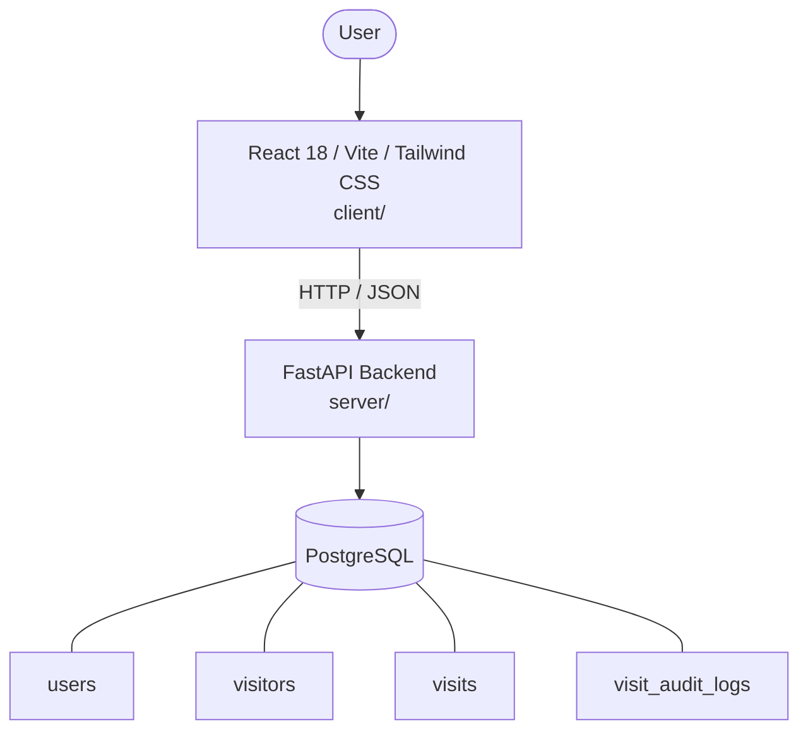

# Architecture

_Auto-generated by the SDLC Assistant from the generated codebase and the approved Feature Spec (latest: SCRUM-280). Regenerated on each push._

## System Diagram

## Tech Stack
- **language**: Python 3.11 / JavaScript (ESNext)
- **backend_framework**: FastAPI
- **orm**: SQLAlchemy 2.x
- **database**: PostgreSQL
- **frontend**: React 18 / Vite / Tailwind CSS
- **cloud_provider**: Google Cloud Platform (GCP)
- **constitution_section_4_followed**: True

## Backend Modules (server/)
- server/__init__.py
- server/auth.py
- server/database.py
- server/main.py
- server/models.py
- server/notifications.py
- server/routers/__init__.py
- server/routers/approvals.py
- server/routers/auth.py
- server/routers/checkin.py
- server/routers/history.py
- server/routers/visitors.py
- server/schemas.py
- server/tests/__init__.py
- server/tests/conftest.py
- server/tests/test_approvals.py
- server/tests/test_checkin.py
- server/tests/test_history.py
- server/tests/test_main.py
- server/tests/test_visitors.py

## Frontend Modules (client/)
- (no client/ files found yet)

## API Endpoints
- POST /api/v1/visitors/register
- GET /api/v1/visitors/hosts
- GET /api/v1/approvals/pending
- POST /api/v1/approvals/{visit_id}/action
- GET /api/v1/checkin/lookup
- POST /api/v1/checkin/{visit_id}/check-in
- POST /api/v1/checkin/{visit_id}/check-out
- GET /api/v1/history

## Data Model
- users
- visitors
- visits
- visit_audit_logs
