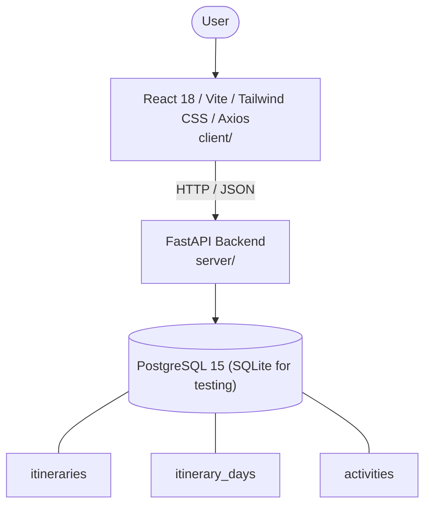

# Architecture

_Auto-generated by the SDLC Assistant from the generated codebase and the approved Feature Spec (latest: SCRUM-369). Regenerated on each push._

## System Diagram

## Tech Stack
- **language**: Python 3.11
- **backend_framework**: FastAPI
- **orm**: SQLAlchemy 2.x
- **database**: PostgreSQL 15 (SQLite for testing)
- **frontend**: React 18 / Vite / Tailwind CSS / Axios
- **cloud_provider**: Google Cloud Platform (GCP Cloud Run, Cloud SQL)
- **constitution_section_4_followed**: True

## Backend Modules (server/)
- server/__init__.py
- server/config.py
- server/database.py
- server/main.py
- server/models.py
- server/routes/__init__.py
- server/routes/activities.py
- server/routes/export.py
- server/routes/itineraries.py
- server/schemas.py
- server/services/__init__.py
- server/services/ai_engine.py
- server/services/budget_service.py
- server/services/export_service.py
- server/services/itinerary_service.py
- server/tests/__init__.py
- server/tests/conftest.py
- server/tests/test_activities.py
- server/tests/test_export.py
- server/tests/test_itineraries.py

## Frontend Modules (client/)
- client/eslint.config.js
- client/postcss.config.js
- client/src/App.jsx
- client/src/components/AnalyticsDashboard.jsx
- client/src/components/CheckoutPage.jsx
- client/src/components/CurrencySelector.jsx
- client/src/components/Navbar.jsx
- client/src/components/RefundPortal.jsx
- client/src/components/StatusBadge.jsx
- client/src/components/WebhookLogViewer.jsx
- client/src/main.jsx
- client/src/pages/AnalyticsPage.jsx
- client/src/pages/CheckoutPage.jsx
- client/src/pages/RefundPortalPage.jsx
- client/src/services/api.js
- client/src/setup.js
- client/src/tests/AnalyticsDashboard.test.jsx
- client/src/tests/CheckoutPage.test.jsx
- client/src/tests/RefundPortal.test.jsx
- client/tailwind.config.js
- client/vite.config.js

## API Endpoints
- POST /api/v1/itineraries/generate
- GET /api/v1/itineraries/{id}
- PUT /api/v1/itineraries/{id}
- POST /api/v1/itineraries/{id}/activities
- PUT /api/v1/itineraries/{id}/activities/{activity_id}
- DELETE /api/v1/itineraries/{id}/activities/{activity_id}
- POST /api/v1/itineraries/{id}/activities/reorder
- GET /api/v1/itineraries/{id}/export/pdf
- GET /api/v1/itineraries/{id}/export/ics
- POST /api/v1/itineraries/{id}/share
- GET /api/v1/itineraries/shared/{share_token}

## Data Model
- itineraries
- itinerary_days
- activities
