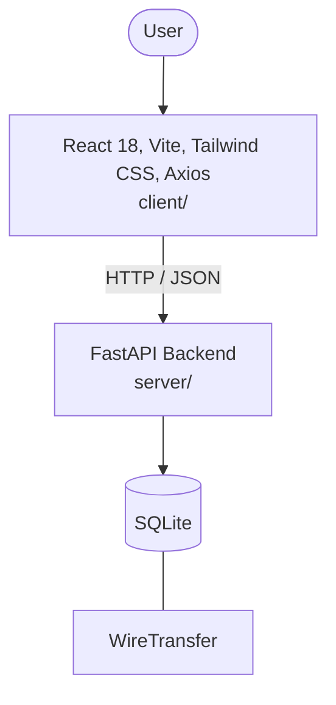

# Architecture

_Auto-generated by the SDLC Assistant from the generated codebase and the approved Feature Spec (latest: SCRUM-298). Regenerated on each push._

## System Diagram

## Tech Stack
- **language**: Python 3.11 / JavaScript (React)
- **backend_framework**: FastAPI
- **orm**: SQLAlchemy 2.x
- **database**: SQLite
- **frontend**: React 18, Vite, Tailwind CSS, Axios
- **cloud_provider**: GCP (Cloud Run)
- **constitution_section_4_followed**: True

## Backend Modules (server/)
- server/__init__.py
- server/conftest.py
- server/database.py
- server/main.py
- server/models.py
- server/routers/__init__.py
- server/routers/wires.py
- server/schemas.py
- server/services/__init__.py
- server/services/wire_service.py
- server/test_main.py

## Frontend Modules (client/)
- (no client/ files found yet)

## API Endpoints
- POST /api/wires
- GET /api/wires/pending
- PUT /api/wires/{id}/approve
- PUT /api/wires/{id}/reject

## Data Model
- WireTransfer
