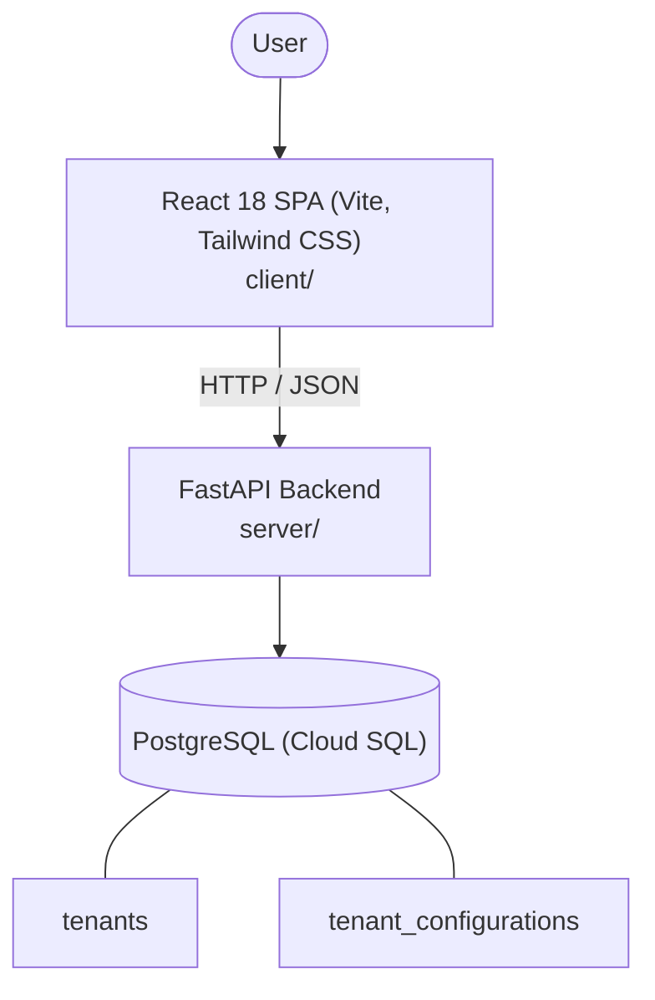

# Architecture

_Auto-generated by the SDLC Assistant from the generated codebase and the approved Feature Spec (latest: SCRUM-304). Regenerated on each push._

## System Diagram

## Tech Stack
- **language**: Python 3.11
- **backend_framework**: FastAPI
- **orm**: SQLAlchemy 2.x
- **database**: PostgreSQL (Cloud SQL)
- **frontend**: React 18 SPA (Vite, Tailwind CSS)
- **cloud_provider**: GCP
- **constitution_section_4_followed**: True

## Backend Modules (server/)
- server/__init__.py
- server/api/__init__.py
- server/api/v1/__init__.py
- server/api/v1/tenants.py
- server/core/__init__.py
- server/core/security.py
- server/database.py
- server/main.py
- server/models/__init__.py
- server/models/tenant.py
- server/schemas/__init__.py
- server/schemas/tenant.py
- server/services/__init__.py
- server/services/tenant_service.py
- server/tests/__init__.py
- server/tests/conftest.py
- server/tests/test_tenants.py

## Frontend Modules (client/)
- (no client/ files found yet)

## API Endpoints
- POST /api/v1/tenants
- GET /api/v1/tenants
- GET /api/v1/tenants/{tenant_id}
- PUT /api/v1/tenants/{tenant_id}
- PATCH /api/v1/tenants/{tenant_id}/status
- PUT /api/v1/tenants/{tenant_id}/configuration
- DELETE /api/v1/tenants/{tenant_id}

## Data Model
- tenants
- tenant_configurations
