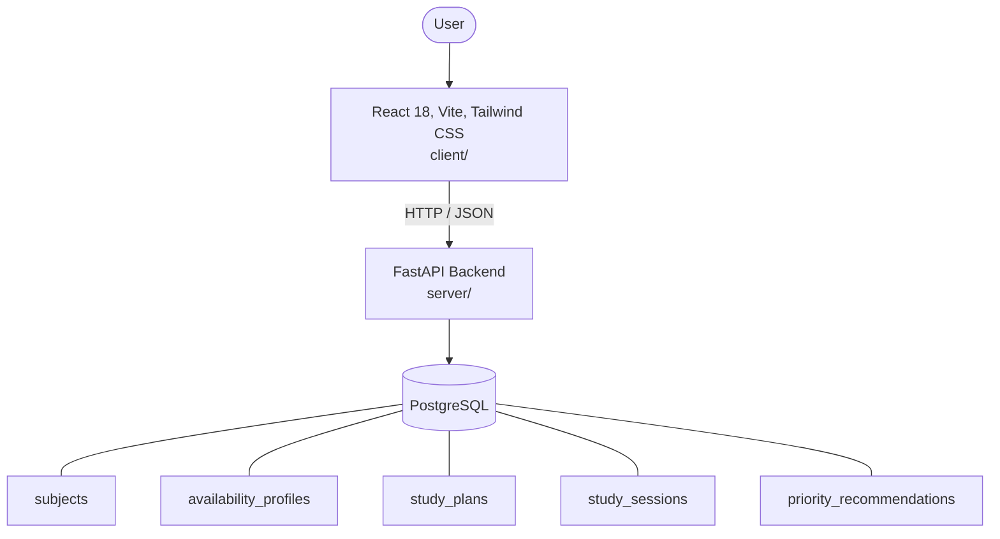

# Architecture

_Auto-generated by the SDLC Assistant from the generated codebase and the approved Feature Spec (latest: SCRUM-363). Regenerated on each push._

## System Diagram

## Tech Stack
- **language**: Python 3.11
- **backend_framework**: FastAPI
- **orm**: SQLAlchemy 2.x
- **database**: PostgreSQL
- **frontend**: React 18, Vite, Tailwind CSS
- **cloud_provider**: GCP (Cloud Run, Cloud SQL)
- **constitution_section_4_followed**: True

## Backend Modules (server/)
- server/__init__.py
- server/api/__init__.py
- server/api/v1/__init__.py
- server/api/v1/etl.py
- server/bq_loader.py
- server/config.py
- server/database.py
- server/db_extractor.py
- server/etl_main.py
- server/main.py
- server/models/__init__.py
- server/models/availability.py
- server/models/recommendation.py
- server/models/study_plan.py
- server/models/study_session.py
- server/models/subject.py
- server/routers/__init__.py
- server/routers/availability.py
- server/routers/health.py
- server/routers/schedules.py
- server/routers/subjects.py
- server/schemas/__init__.py
- server/schemas/availability.py
- server/schemas/schedule.py
- server/schemas/subject.py
- server/services/__init__.py
- server/services/ai_engine.py
- server/services/schedule_service.py
- server/services/subject_service.py
- server/tests/__init__.py
- server/tests/conftest.py
- server/tests/test_availability.py
- server/tests/test_etl_api.py
- server/tests/test_health.py
- server/tests/test_schedules.py
- server/tests/test_subjects.py
- server/transformer.py

## Frontend Modules (client/)
- client/eslint.config.js
- client/postcss.config.js
- client/src/App.jsx
- client/src/components/AnalyticsDashboard.jsx
- client/src/components/CheckoutPage.jsx
- client/src/components/CurrencySelector.jsx
- client/src/components/Navbar.jsx
- client/src/components/RefundPortal.jsx
- client/src/components/StatusBadge.jsx
- client/src/components/WebhookLogViewer.jsx
- client/src/main.jsx
- client/src/pages/AnalyticsPage.jsx
- client/src/pages/CheckoutPage.jsx
- client/src/pages/RefundPortalPage.jsx
- client/src/services/api.js
- client/src/setup.js
- client/src/tests/AnalyticsDashboard.test.jsx
- client/src/tests/CheckoutPage.test.jsx
- client/src/tests/RefundPortal.test.jsx
- client/tailwind.config.js
- client/vite.config.js

## API Endpoints
- POST /api/v1/subjects
- GET /api/v1/subjects
- POST /api/v1/availability
- POST /api/v1/schedules/generate
- GET /api/v1/schedules/{id}
- PATCH /api/v1/schedules/sessions/{session_id}

## Data Model
- subjects
- availability_profiles
- study_plans
- study_sessions
- priority_recommendations
