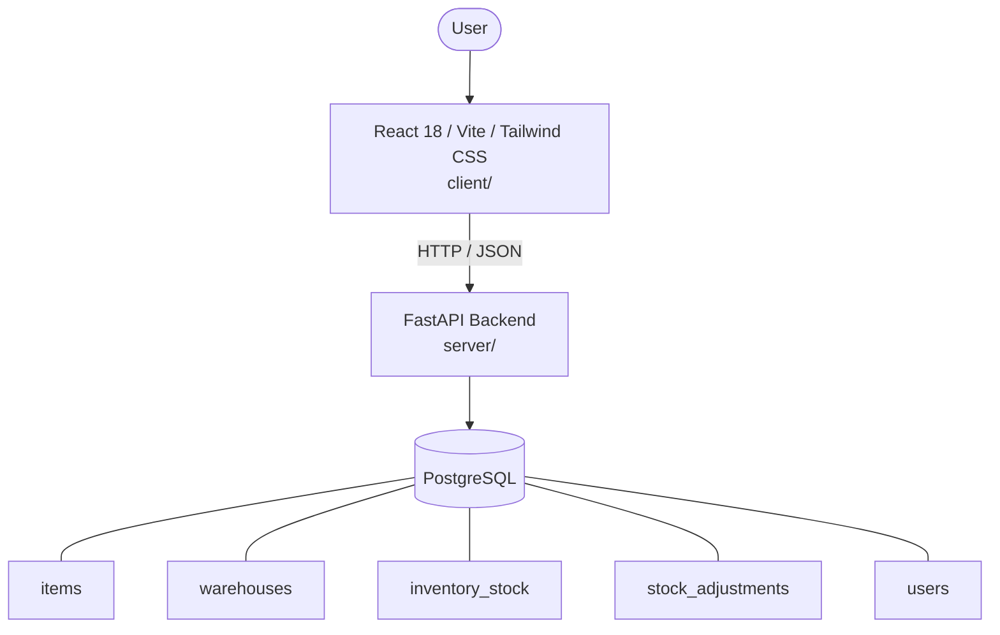

# Architecture

_Auto-generated by the SDLC Assistant from the generated codebase and the approved Feature Spec (latest: SCRUM-2). Regenerated on each push._

## System Diagram

## Tech Stack
- **language**: Python 3.11
- **backend_framework**: FastAPI
- **orm**: SQLAlchemy 2.x
- **database**: PostgreSQL
- **frontend**: React 18 / Vite / Tailwind CSS
- **cloud_provider**: GCP Cloud Run
- **constitution_section_4_followed**: True

## Backend Modules (server/)
- server/__init__.py
- server/config.py
- server/database.py
- server/main.py
- server/models/__init__.py
- server/models/audit_log.py
- server/models/inventory.py
- server/models/item.py
- server/models/user.py
- server/models/warehouse.py
- server/notifications.py
- server/routers/__init__.py
- server/routers/adjustments.py
- server/routers/alerts.py
- server/routers/inventory.py
- server/routers/items.py
- server/routers/warehouses.py
- server/schemas/__init__.py
- server/schemas/alert.py
- server/schemas/audit_log.py
- server/schemas/inventory.py
- server/schemas/item.py
- server/schemas/warehouse.py
- server/tests/__init__.py
- server/tests/conftest.py
- server/tests/test_adjustments.py
- server/tests/test_alerts.py
- server/tests/test_inventory.py
- server/tests/test_items.py
- server/tests/test_warehouses.py

## Frontend Modules (client/)
- client/eslint.config.js
- client/postcss.config.js
- client/src/App.jsx
- client/src/components/AnalyticsDashboard.jsx
- client/src/components/CheckoutPage.jsx
- client/src/components/CurrencySelector.jsx
- client/src/components/Navbar.jsx
- client/src/components/RefundPortal.jsx
- client/src/components/StatusBadge.jsx
- client/src/components/WebhookLogViewer.jsx
- client/src/main.jsx
- client/src/pages/AnalyticsPage.jsx
- client/src/pages/CheckoutPage.jsx
- client/src/pages/RefundPortalPage.jsx
- client/src/services/api.js
- client/src/setup.js
- client/src/tests/AnalyticsDashboard.test.jsx
- client/src/tests/CheckoutPage.test.jsx
- client/src/tests/RefundPortal.test.jsx
- client/tailwind.config.js
- client/vite.config.js

## API Endpoints
- GET /api/v1/inventory
- GET /api/v1/items
- POST /api/v1/items
- GET /api/v1/items/{item_id}
- PUT /api/v1/items/{item_id}
- POST /api/v1/inventory/adjust
- GET /api/v1/inventory/audit-logs
- GET /api/v1/alerts

## Data Model
- items
- warehouses
- inventory_stock
- stock_adjustments
- users
