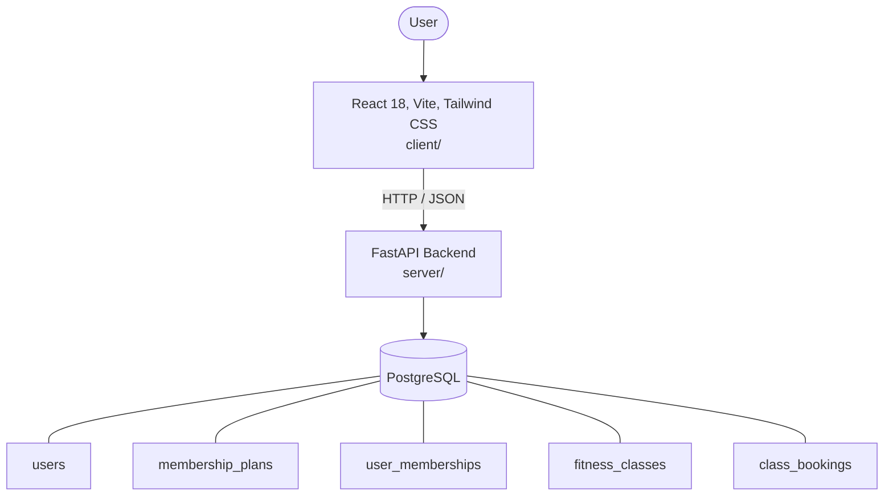

# Architecture

_Auto-generated by the SDLC Assistant from the generated codebase and the approved Feature Spec (latest: SCRUM-282). Regenerated on each push._

## System Diagram

## Tech Stack
- **language**: Python 3.11
- **backend_framework**: FastAPI
- **orm**: SQLAlchemy 2.x
- **database**: PostgreSQL
- **frontend**: React 18, Vite, Tailwind CSS
- **cloud_provider**: GCP (Cloud Run, Cloud SQL)
- **constitution_section_4_followed**: True

## Backend Modules (server/)
- server/__init__.py
- server/api/__init__.py
- server/api/v1/__init__.py
- server/api/v1/admin.py
- server/api/v1/auth.py
- server/api/v1/bookings.py
- server/api/v1/classes.py
- server/api/v1/health.py
- server/api/v1/memberships.py
- server/api/v1/users.py
- server/core/__init__.py
- server/core/config.py
- server/core/deps.py
- server/core/security.py
- server/database.py
- server/main.py
- server/models/__init__.py
- server/models/booking.py
- server/models/fitness_class.py
- server/models/membership.py
- server/models/user.py
- server/schemas/__init__.py
- server/schemas/auth.py
- server/schemas/booking.py
- server/schemas/fitness_class.py
- server/schemas/membership.py
- server/schemas/user.py
- server/tests/__init__.py
- server/tests/conftest.py
- server/tests/test_admin.py
- server/tests/test_auth.py
- server/tests/test_bookings.py
- server/tests/test_classes.py
- server/tests/test_health.py
- server/tests/test_memberships.py
- server/tests/test_users.py

## Frontend Modules (client/)
- (no client/ files found yet)

## API Endpoints
- POST /api/v1/auth/register
- POST /api/v1/auth/login
- GET /api/v1/users/me
- PUT /api/v1/users/me
- GET /api/v1/memberships/plans
- POST /api/v1/memberships/subscribe
- GET /api/v1/memberships/me
- GET /api/v1/classes
- GET /api/v1/classes/{class_id}
- POST /api/v1/bookings
- GET /api/v1/bookings/me
- DELETE /api/v1/bookings/{booking_id}
- POST /api/v1/admin/classes
- PUT /api/v1/admin/classes/{class_id}
- DELETE /api/v1/admin/classes/{class_id}
- GET /api/v1/admin/classes/{class_id}/roster

## Data Model
- users
- membership_plans
- user_memberships
- fitness_classes
- class_bookings
