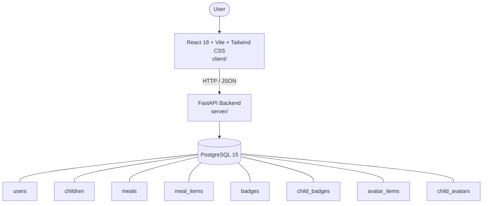

# Architecture

_Auto-generated by the SDLC Assistant from the generated codebase and the approved Feature Spec (latest: SCRUM-402). Regenerated on each push._

## System Diagram

```mermaid
graph TD
  User([User])
  UI["React 18 + Vite + Tailwind CSS<br/>client/"]
  API["FastAPI Backend<br/>server/"]
  DB[("PostgreSQL 15")]
  User --> UI
  UI -->|HTTP / JSON| API
  API --> DB
  DB --- tbl_users["users"]
  DB --- tbl_children["children"]
  DB --- tbl_meals["meals"]
  DB --- tbl_meal_items["meal_items"]
  DB --- tbl_badges["badges"]
  DB --- tbl_child_badges["child_badges"]
  DB --- tbl_avatar_items["avatar_items"]
  DB --- tbl_child_avatars["child_avatars"]
```

## Tech Stack
- **language**: Python 3.11
- **backend_framework**: FastAPI
- **orm**: SQLAlchemy 2.x
- **database**: PostgreSQL 15
- **frontend**: React 18 + Vite + Tailwind CSS
- **cloud_provider**: Google Cloud Platform (Cloud Run, Cloud SQL)
- **constitution_section_4_followed**: True

## Backend Modules (server/)
- server/__init__.py
- server/api/__init__.py
- server/api/v1/__init__.py
- server/app/__init__.py
- server/app/database.py
- server/app/models.py
- server/app/routers/__init__.py
- server/app/routers/auth.py
- server/app/routers/avatars.py
- server/app/routers/dashboard.py
- server/app/routers/meals.py
- server/app/routers/profiles.py
- server/app/routers/quizzes.py
- server/app/routers/rewards.py
- server/app/schemas.py
- server/app/services/__init__.py
- server/app/services/auth_service.py
- server/app/services/dashboard_service.py
- server/app/services/meal_service.py
- server/app/services/quiz_service.py
- server/app/services/reward_service.py
- server/main.py
- server/services/__init__.py
- server/tests/__init__.py
- server/tests/conftest.py
- server/tests/test_auth.py
- server/tests/test_avatars.py
- server/tests/test_dashboard.py
- server/tests/test_meals.py
- server/tests/test_profiles.py
- server/tests/test_quizzes.py
- server/tests/test_rewards.py

## Frontend Modules (client/)
- client/eslint.config.js
- client/postcss.config.js
- client/src/App.jsx
- client/src/components/AnalyticsDashboard.jsx
- client/src/components/CheckoutPage.jsx
- client/src/components/CurrencySelector.jsx
- client/src/components/Navbar.jsx
- client/src/components/RefundPortal.jsx
- client/src/components/StatusBadge.jsx
- client/src/components/WebhookLogViewer.jsx
- client/src/main.jsx
- client/src/pages/AnalyticsPage.jsx
- client/src/pages/CheckoutPage.jsx
- client/src/pages/RefundPortalPage.jsx
- client/src/services/api.js
- client/src/setup.js
- client/src/tests/AnalyticsDashboard.test.jsx
- client/src/tests/CheckoutPage.test.jsx
- client/src/tests/RefundPortal.test.jsx
- client/tailwind.config.js
- client/vite.config.js

## API Endpoints
- POST /api/v1/auth/register
- POST /api/v1/auth/login
- GET /api/v1/profiles
- POST /api/v1/profiles
- POST /api/v1/meals
- GET /api/v1/meals
- GET /api/v1/dashboard/weekly
- GET /api/v1/rewards/badges
- GET /api/v1/rewards/streak
- GET /api/v1/quizzes/daily
- POST /api/v1/quizzes/submit
- GET /api/v1/avatars/catalog
- POST /api/v1/avatars/unlock
- PUT /api/v1/avatars/equip

## Data Model
- users
- children
- meals
- meal_items
- badges
- child_badges
- avatar_items
- child_avatars
