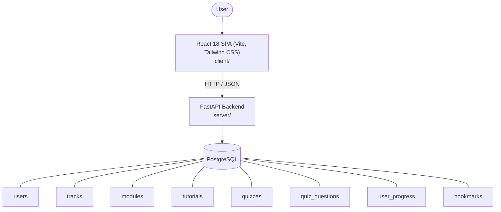

# Architecture

_Auto-generated by the SDLC Assistant from the generated codebase and the approved Feature Spec (latest: SCRUM-398). Regenerated on each push._

## System Diagram

```mermaid
graph TD
  User([User])
  UI["React 18 SPA (Vite, Tailwind CSS)<br/>client/"]
  API["FastAPI Backend<br/>server/"]
  DB[("PostgreSQL")]
  User --> UI
  UI -->|HTTP / JSON| API
  API --> DB
  DB --- tbl_users["users"]
  DB --- tbl_tracks["tracks"]
  DB --- tbl_modules["modules"]
  DB --- tbl_tutorials["tutorials"]
  DB --- tbl_quizzes["quizzes"]
  DB --- tbl_quiz_questions["quiz_questions"]
  DB --- tbl_user_progress["user_progress"]
  DB --- tbl_bookmarks["bookmarks"]
```

## Tech Stack
- **language**: Python 3.11
- **backend_framework**: FastAPI
- **orm**: SQLAlchemy 2.x
- **database**: PostgreSQL
- **frontend**: React 18 SPA (Vite, Tailwind CSS)
- **cloud_provider**: Google Cloud Platform (GCP)
- **constitution_section_4_followed**: True

## Backend Modules (server/)
- server/__init__.py
- server/api/__init__.py
- server/api/v1/__init__.py
- server/api/v1/auth.py
- server/api/v1/bookmarks.py
- server/api/v1/modules.py
- server/api/v1/progress.py
- server/api/v1/quizzes.py
- server/api/v1/tracks.py
- server/api/v1/tutorials.py
- server/core/__init__.py
- server/core/config.py
- server/core/database.py
- server/core/security.py
- server/database.py
- server/main.py
- server/models/__init__.py
- server/models/bookmark.py
- server/models/module.py
- server/models/progress.py
- server/models/quiz.py
- server/models/track.py
- server/models/tutorial.py
- server/models/user.py
- server/schemas/__init__.py
- server/schemas/auth.py
- server/schemas/bookmark.py
- server/schemas/module.py
- server/schemas/progress.py
- server/schemas/quiz.py
- server/schemas/track.py
- server/schemas/tutorial.py
- server/services/__init__.py
- server/services/seed_data.py
- server/tests/conftest.py
- server/tests/test_auth.py
- server/tests/test_bookmarks.py
- server/tests/test_progress.py
- server/tests/test_quizzes.py
- server/tests/test_tracks.py

## Frontend Modules (client/)
- client/eslint.config.js
- client/postcss.config.js
- client/src/App.jsx
- client/src/components/AnalyticsDashboard.jsx
- client/src/components/CheckoutPage.jsx
- client/src/components/CurrencySelector.jsx
- client/src/components/Navbar.jsx
- client/src/components/RefundPortal.jsx
- client/src/components/StatusBadge.jsx
- client/src/components/WebhookLogViewer.jsx
- client/src/main.jsx
- client/src/pages/AnalyticsPage.jsx
- client/src/pages/CheckoutPage.jsx
- client/src/pages/RefundPortalPage.jsx
- client/src/services/api.js
- client/src/setup.js
- client/src/tests/AnalyticsDashboard.test.jsx
- client/src/tests/CheckoutPage.test.jsx
- client/src/tests/RefundPortal.test.jsx
- client/tailwind.config.js
- client/vite.config.js

## API Endpoints
- POST /api/v1/auth/register
- POST /api/v1/auth/login
- GET /api/v1/auth/me
- GET /api/v1/tracks
- GET /api/v1/tracks/{slug}
- GET /api/v1/modules/{slug}
- GET /api/v1/tutorials/{slug}
- GET /api/v1/tutorials/search
- GET /api/v1/quizzes/{module_id}
- POST /api/v1/quizzes/{quiz_id}/submit
- GET /api/v1/progress
- POST /api/v1/progress/{module_id}/touch
- GET /api/v1/bookmarks
- POST /api/v1/bookmarks/{tutorial_id}
- DELETE /api/v1/bookmarks/{tutorial_id}

## Data Model
- users
- tracks
- modules
- tutorials
- quizzes
- quiz_questions
- user_progress
- bookmarks
