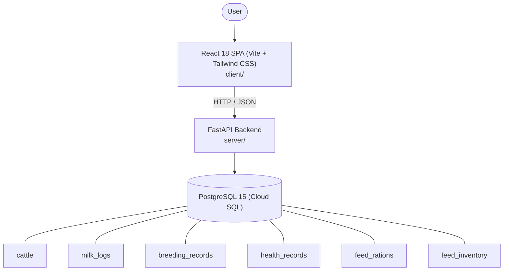

# Architecture

_Auto-generated by the SDLC Assistant from the generated codebase and the approved Feature Spec (latest: SCRUM-413). Regenerated on each push._

## System Diagram

```mermaid
graph TD
  User([User])
  UI["React 18 SPA (Vite + Tailwind CSS)<br/>client/"]
  API["FastAPI Backend<br/>server/"]
  DB[("PostgreSQL 15 (Cloud SQL)")]
  User --> UI
  UI -->|HTTP / JSON| API
  API --> DB
  DB --- tbl_cattle["cattle"]
  DB --- tbl_milk_logs["milk_logs"]
  DB --- tbl_breeding_records["breeding_records"]
  DB --- tbl_health_records["health_records"]
  DB --- tbl_feed_rations["feed_rations"]
  DB --- tbl_feed_inventory["feed_inventory"]
```

## Tech Stack
- **language**: Python 3.11 / TypeScript
- **backend_framework**: FastAPI
- **orm**: SQLAlchemy 2.x
- **database**: PostgreSQL 15 (Cloud SQL)
- **frontend**: React 18 SPA (Vite + Tailwind CSS)
- **cloud_provider**: Google Cloud Platform (GCP Cloud Run)
- **constitution_section_4_followed**: True

## Backend Modules (server/)
- server/__init__.py
- server/database.py
- server/main.py
- server/models.py
- server/routers/__init__.py
- server/routers/analytics.py
- server/routers/breeding.py
- server/routers/cattle.py
- server/routers/feed.py
- server/routers/health.py
- server/routers/milking.py
- server/schemas.py
- server/tests/__init__.py
- server/tests/conftest.py
- server/tests/test_analytics.py
- server/tests/test_breeding.py
- server/tests/test_cattle.py
- server/tests/test_feed.py
- server/tests/test_health.py
- server/tests/test_milking.py

## Frontend Modules (client/)
- client/eslint.config.js
- client/postcss.config.js
- client/src/App.jsx
- client/src/components/AnalyticsDashboard.jsx
- client/src/components/CheckoutPage.jsx
- client/src/components/CurrencySelector.jsx
- client/src/components/Navbar.jsx
- client/src/components/RefundPortal.jsx
- client/src/components/StatusBadge.jsx
- client/src/components/WebhookLogViewer.jsx
- client/src/main.jsx
- client/src/pages/AnalyticsPage.jsx
- client/src/pages/CheckoutPage.jsx
- client/src/pages/RefundPortalPage.jsx
- client/src/services/api.js
- client/src/setup.js
- client/src/tests/AnalyticsDashboard.test.jsx
- client/src/tests/CheckoutPage.test.jsx
- client/src/tests/RefundPortal.test.jsx
- client/tailwind.config.js
- client/vite.config.js

## API Endpoints
- GET /api/v1/cattle
- POST /api/v1/cattle
- GET /api/v1/cattle/{id}
- PUT /api/v1/cattle/{id}
- GET /api/v1/milk-logs
- POST /api/v1/milk-logs
- GET /api/v1/milk-logs/summary
- GET /api/v1/breeding-records
- POST /api/v1/breeding-records
- PUT /api/v1/breeding-records/{id}
- GET /api/v1/feed-rations
- POST /api/v1/feed-rations
- GET /api/v1/feed-inventory
- POST /api/v1/feed-inventory
- GET /api/v1/health-records
- POST /api/v1/health-records
- GET /api/v1/health-records/active-withdrawals
- GET /api/v1/analytics/dashboard

## Data Model
- cattle
- milk_logs
- breeding_records
- health_records
- feed_rations
- feed_inventory
