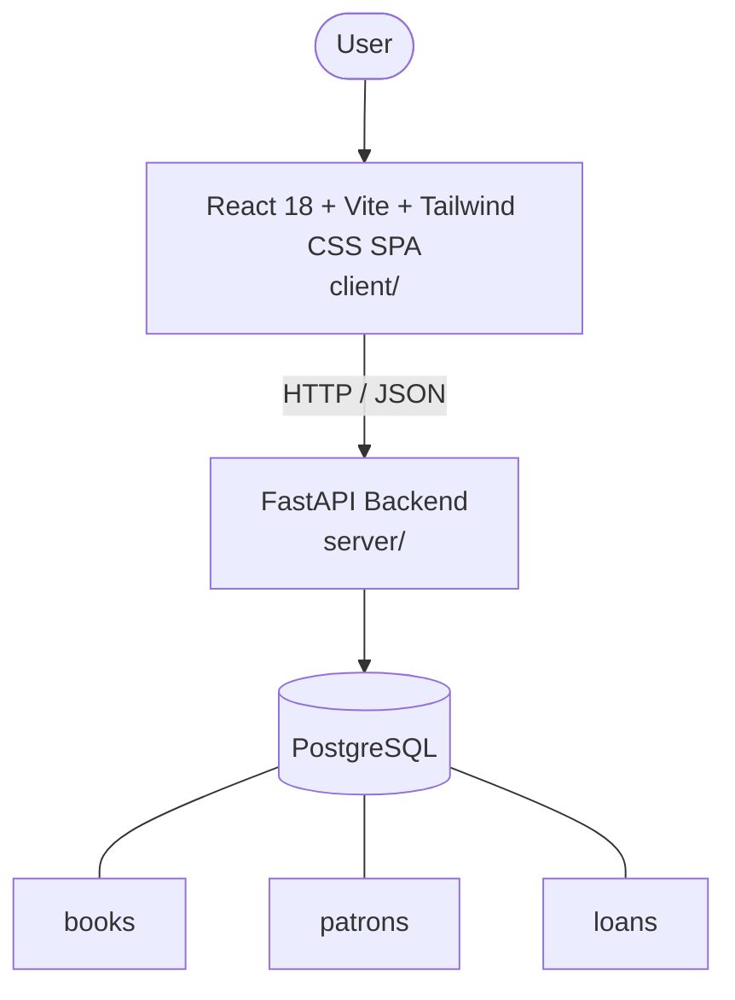

# Architecture

_Auto-generated by the SDLC Assistant from the generated codebase and the approved Feature Spec (latest: SCRUM-404). Regenerated on each push._

## System Diagram

```mermaid
graph TD
  User([User])
  UI["React 18 + Vite + Tailwind CSS SPA<br/>client/"]
  API["FastAPI Backend<br/>server/"]
  DB[("PostgreSQL")]
  User --> UI
  UI -->|HTTP / JSON| API
  API --> DB
  DB --- tbl_books["books"]
  DB --- tbl_patrons["patrons"]
  DB --- tbl_loans["loans"]
```

## Tech Stack
- **language**: Python 3.11
- **backend_framework**: FastAPI
- **orm**: SQLAlchemy 2.x
- **database**: PostgreSQL
- **frontend**: React 18 + Vite + Tailwind CSS SPA
- **cloud_provider**: Google Cloud Platform (GCP Cloud Run)
- **constitution_section_4_followed**: True

## Backend Modules (server/)
- server/__init__.py
- server/api/__init__.py
- server/api/v1/__init__.py
- server/api/v1/books.py
- server/api/v1/health.py
- server/api/v1/loans.py
- server/api/v1/patrons.py
- server/config.py
- server/database.py
- server/main.py
- server/models/__init__.py
- server/models/book.py
- server/models/loan.py
- server/models/patron.py
- server/schemas/__init__.py
- server/schemas/book.py
- server/schemas/loan.py
- server/schemas/patron.py
- server/services/__init__.py
- server/services/book_service.py
- server/services/loan_service.py
- server/services/patron_service.py
- server/tests/__init__.py
- server/tests/conftest.py
- server/tests/test_books.py
- server/tests/test_health.py
- server/tests/test_loans.py
- server/tests/test_patrons.py

## Frontend Modules (client/)
- client/eslint.config.js
- client/postcss.config.js
- client/src/App.jsx
- client/src/components/AnalyticsDashboard.jsx
- client/src/components/CheckoutPage.jsx
- client/src/components/CurrencySelector.jsx
- client/src/components/Navbar.jsx
- client/src/components/RefundPortal.jsx
- client/src/components/StatusBadge.jsx
- client/src/components/WebhookLogViewer.jsx
- client/src/main.jsx
- client/src/pages/AnalyticsPage.jsx
- client/src/pages/CheckoutPage.jsx
- client/src/pages/RefundPortalPage.jsx
- client/src/services/api.js
- client/src/setup.js
- client/src/tests/AnalyticsDashboard.test.jsx
- client/src/tests/CheckoutPage.test.jsx
- client/src/tests/RefundPortal.test.jsx
- client/tailwind.config.js
- client/vite.config.js

## API Endpoints
- POST /api/v1/books
- GET /api/v1/books
- GET /api/v1/books/{book_id}
- PUT /api/v1/books/{book_id}
- DELETE /api/v1/books/{book_id}
- POST /api/v1/patrons
- GET /api/v1/patrons
- GET /api/v1/patrons/{patron_id}
- PUT /api/v1/patrons/{patron_id}
- GET /api/v1/patrons/{patron_id}/loans
- POST /api/v1/loans/checkout
- POST /api/v1/loans/{loan_id}/return
- GET /api/v1/loans
- GET /api/v1/loans/overdue
- GET /api/v1/health

## Data Model
- books
- patrons
- loans
