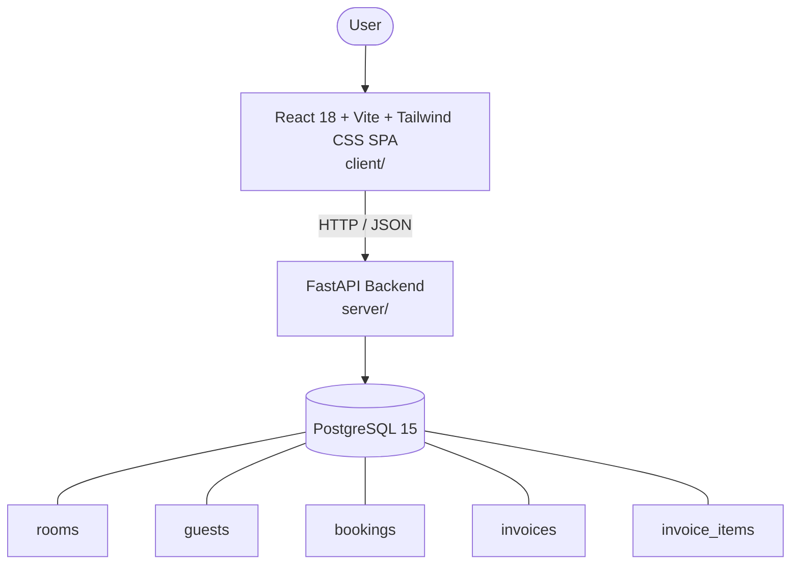

# Architecture

_Auto-generated by the SDLC Assistant from the generated codebase and the approved Feature Spec (latest: SCRUM-417). Regenerated on each push._

## System Diagram

```mermaid
graph TD
  User([User])
  UI["React 18 + Vite + Tailwind CSS SPA<br/>client/"]
  API["FastAPI Backend<br/>server/"]
  DB[("PostgreSQL 15")]
  User --> UI
  UI -->|HTTP / JSON| API
  API --> DB
  DB --- tbl_rooms["rooms"]
  DB --- tbl_guests["guests"]
  DB --- tbl_bookings["bookings"]
  DB --- tbl_invoices["invoices"]
  DB --- tbl_invoice_items["invoice_items"]
```

## Tech Stack
- **language**: Python 3.11
- **backend_framework**: FastAPI
- **orm**: SQLAlchemy 2.x
- **database**: PostgreSQL 15
- **frontend**: React 18 + Vite + Tailwind CSS SPA
- **cloud_provider**: GCP (Cloud Run + Cloud SQL)
- **constitution_section_4_followed**: True

## Backend Modules (server/)
- server/__init__.py
- server/config.py
- server/database.py
- server/main.py
- server/models.py
- server/routers/__init__.py
- server/routers/analytics.py
- server/routers/bookings.py
- server/routers/guests.py
- server/routers/invoices.py
- server/routers/rooms.py
- server/schemas.py
- server/tests/__init__.py
- server/tests/conftest.py
- server/tests/test_api.py

## Frontend Modules (client/)
- client/eslint.config.js
- client/postcss.config.js
- client/src/App.jsx
- client/src/components/AnalyticsDashboard.jsx
- client/src/components/CheckoutPage.jsx
- client/src/components/CurrencySelector.jsx
- client/src/components/Navbar.jsx
- client/src/components/RefundPortal.jsx
- client/src/components/StatusBadge.jsx
- client/src/components/WebhookLogViewer.jsx
- client/src/main.jsx
- client/src/pages/AnalyticsPage.jsx
- client/src/pages/CheckoutPage.jsx
- client/src/pages/RefundPortalPage.jsx
- client/src/services/api.js
- client/src/setup.js
- client/src/tests/AnalyticsDashboard.test.jsx
- client/src/tests/CheckoutPage.test.jsx
- client/src/tests/RefundPortal.test.jsx
- client/tailwind.config.js
- client/vite.config.js

## API Endpoints
- GET /api/v1/rooms
- POST /api/v1/rooms
- PATCH /api/v1/rooms/{id}/status
- GET /api/v1/guests
- POST /api/v1/guests
- POST /api/v1/bookings
- POST /api/v1/bookings/{id}/check-in
- POST /api/v1/bookings/{id}/check-out
- GET /api/v1/invoices/{id}
- POST /api/v1/invoices/{id}/items
- POST /api/v1/invoices/{id}/pay
- GET /api/v1/analytics/dashboard

## Data Model
- rooms
- guests
- bookings
- invoices
- invoice_items
