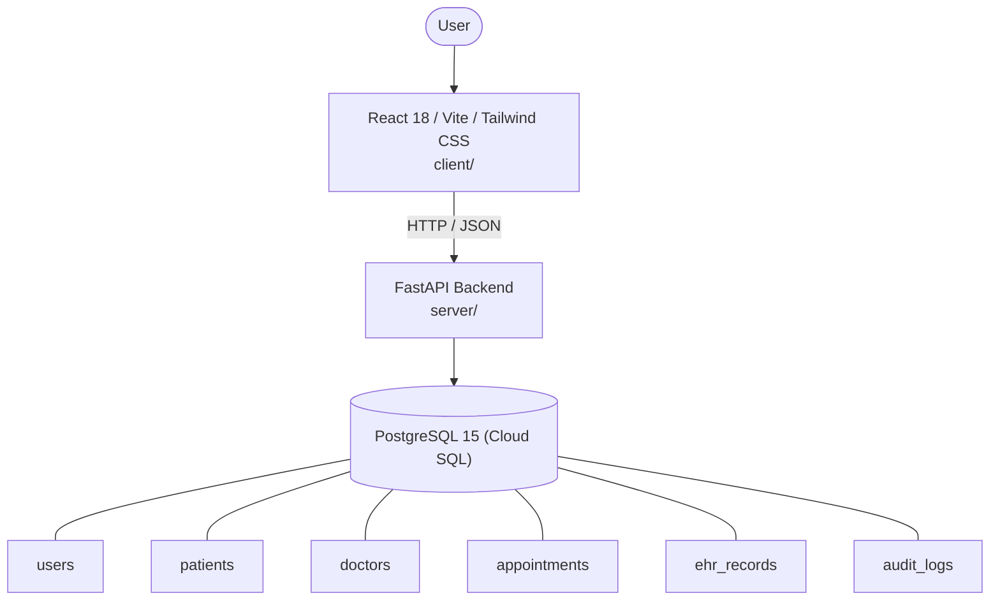

# Architecture

_Auto-generated by the SDLC Assistant from the generated codebase and the approved Feature Spec (latest: SCRUM-423). Regenerated on each push._

## System Diagram

```mermaid
graph TD
  User([User])
  UI["React 18 / Vite / Tailwind CSS<br/>client/"]
  API["FastAPI Backend<br/>server/"]
  DB[("PostgreSQL 15 (Cloud SQL)")]
  User --> UI
  UI -->|HTTP / JSON| API
  API --> DB
  DB --- tbl_users["users"]
  DB --- tbl_patients["patients"]
  DB --- tbl_doctors["doctors"]
  DB --- tbl_appointments["appointments"]
  DB --- tbl_ehr_records["ehr_records"]
  DB --- tbl_audit_logs["audit_logs"]
```

## Tech Stack
- **language**: Python 3.11
- **backend_framework**: FastAPI
- **orm**: SQLAlchemy 2.x
- **database**: PostgreSQL 15 (Cloud SQL)
- **frontend**: React 18 / Vite / Tailwind CSS
- **cloud_provider**: Google Cloud Platform (GCP)
- **constitution_section_4_followed**: True

## Backend Modules (server/)
- server/__init__.py
- server/api/__init__.py
- server/api/v1/__init__.py
- server/auth.py
- server/config.py
- server/database.py
- server/dependencies.py
- server/main.py
- server/models.py
- server/routers/__init__.py
- server/routers/appointments.py
- server/routers/audit.py
- server/routers/auth.py
- server/routers/doctors.py
- server/routers/ehr.py
- server/routers/patients.py
- server/schemas.py
- server/services/__init__.py
- server/tests/__init__.py
- server/tests/conftest.py
- server/tests/test_appointments.py
- server/tests/test_audit.py
- server/tests/test_auth.py
- server/tests/test_doctors.py
- server/tests/test_ehr.py
- server/tests/test_patients.py

## Frontend Modules (client/)
- client/eslint.config.js
- client/postcss.config.js
- client/src/App.jsx
- client/src/components/AnalyticsDashboard.jsx
- client/src/components/CheckoutPage.jsx
- client/src/components/CurrencySelector.jsx
- client/src/components/Navbar.jsx
- client/src/components/RefundPortal.jsx
- client/src/components/StatusBadge.jsx
- client/src/components/WebhookLogViewer.jsx
- client/src/main.jsx
- client/src/pages/AnalyticsPage.jsx
- client/src/pages/CheckoutPage.jsx
- client/src/pages/RefundPortalPage.jsx
- client/src/services/api.js
- client/src/setup.js
- client/src/tests/AnalyticsDashboard.test.jsx
- client/src/tests/CheckoutPage.test.jsx
- client/src/tests/RefundPortal.test.jsx
- client/tailwind.config.js
- client/vite.config.js

## API Endpoints
- POST /api/v1/auth/register
- POST /api/v1/auth/login
- GET /api/v1/auth/me
- POST /api/v1/patients
- GET /api/v1/patients/{patient_id}
- GET /api/v1/patients
- GET /api/v1/doctors
- GET /api/v1/appointments/slots
- POST /api/v1/appointments
- PATCH /api/v1/appointments/{appointment_id}/status
- POST /api/v1/ehr/records
- GET /api/v1/ehr/patients/{patient_id}
- GET /api/v1/ehr/records/{record_id}/download-prescription
- GET /api/v1/audit/logs

## Data Model
- users
- patients
- doctors
- appointments
- ehr_records
- audit_logs
