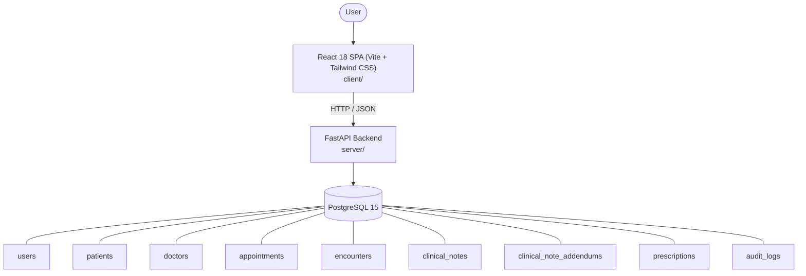

# Architecture

_Auto-generated by the SDLC Assistant from the generated codebase and the approved Feature Spec (latest: SCRUM-403). Regenerated on each push._

## System Diagram

```mermaid
graph TD
  User([User])
  UI["React 18 SPA (Vite + Tailwind CSS)<br/>client/"]
  API["FastAPI Backend<br/>server/"]
  DB[("PostgreSQL 15")]
  User --> UI
  UI -->|HTTP / JSON| API
  API --> DB
  DB --- tbl_users["users"]
  DB --- tbl_patients["patients"]
  DB --- tbl_doctors["doctors"]
  DB --- tbl_appointments["appointments"]
  DB --- tbl_encounters["encounters"]
  DB --- tbl_clinical_notes["clinical_notes"]
  DB --- tbl_clinical_note_addendums["clinical_note_addendums"]
  DB --- tbl_prescriptions["prescriptions"]
  DB --- tbl_audit_logs["audit_logs"]
```

## Tech Stack
- **language**: Python 3.11
- **backend_framework**: FastAPI
- **orm**: SQLAlchemy 2.x
- **database**: PostgreSQL 15
- **frontend**: React 18 SPA (Vite + Tailwind CSS)
- **cloud_provider**: Google Cloud Platform (GCP - Cloud Run, Cloud SQL)
- **constitution_section_4_followed**: True

## Backend Modules (server/)
- server/__init__.py
- server/api/__init__.py
- server/api/v1/__init__.py
- server/api/v1/audit.py
- server/app/__init__.py
- server/app/api/__init__.py
- server/app/api/deps.py
- server/app/api/v1/__init__.py
- server/app/api/v1/appointments.py
- server/app/api/v1/audit.py
- server/app/api/v1/auth.py
- server/app/api/v1/medical_records.py
- server/app/api/v1/patients.py
- server/app/api/v1/router.py
- server/app/core/__init__.py
- server/app/core/config.py
- server/app/core/database.py
- server/app/core/security.py
- server/app/main.py
- server/app/models/__init__.py
- server/app/models/appointment.py
- server/app/models/audit_log.py
- server/app/models/doctor.py
- server/app/models/medical_record.py
- server/app/models/patient.py
- server/app/models/user.py
- server/app/schemas/__init__.py
- server/app/schemas/appointment.py
- server/app/schemas/audit_log.py
- server/app/schemas/auth.py
- server/app/schemas/medical_record.py
- server/app/schemas/patient.py
- server/app/services/appointment_service.py
- server/app/services/audit_service.py
- server/app/services/emr_service.py
- server/config.py
- server/database.py
- server/main.py
- server/models.py
- server/schemas.py

## Frontend Modules (client/)
- client/eslint.config.js
- client/postcss.config.js
- client/src/App.jsx
- client/src/components/AnalyticsDashboard.jsx
- client/src/components/CheckoutPage.jsx
- client/src/components/CurrencySelector.jsx
- client/src/components/Navbar.jsx
- client/src/components/RefundPortal.jsx
- client/src/components/StatusBadge.jsx
- client/src/components/WebhookLogViewer.jsx
- client/src/main.jsx
- client/src/pages/AnalyticsPage.jsx
- client/src/pages/CheckoutPage.jsx
- client/src/pages/RefundPortalPage.jsx
- client/src/services/api.js
- client/src/setup.js
- client/src/tests/AnalyticsDashboard.test.jsx
- client/src/tests/CheckoutPage.test.jsx
- client/src/tests/RefundPortal.test.jsx
- client/tailwind.config.js
- client/vite.config.js

## API Endpoints
- POST /api/v1/auth/login
- POST /api/v1/auth/register
- GET /api/v1/auth/me
- POST /api/v1/patients
- GET /api/v1/patients
- GET /api/v1/patients/{patient_id}
- PUT /api/v1/patients/{patient_id}
- POST /api/v1/appointments
- GET /api/v1/appointments
- GET /api/v1/appointments/{appointment_id}
- PATCH /api/v1/appointments/{appointment_id}/status
- GET /api/v1/appointments/doctors/{doctor_id}/availability
- POST /api/v1/medical-records/encounters
- GET /api/v1/medical-records/encounters/{patient_id}
- POST /api/v1/medical-records/notes
- POST /api/v1/medical-records/notes/{note_id}/addendums
- POST /api/v1/medical-records/prescriptions
- GET /api/v1/audit/logs

## Data Model
- users
- patients
- doctors
- appointments
- encounters
- clinical_notes
- clinical_note_addendums
- prescriptions
- audit_logs
